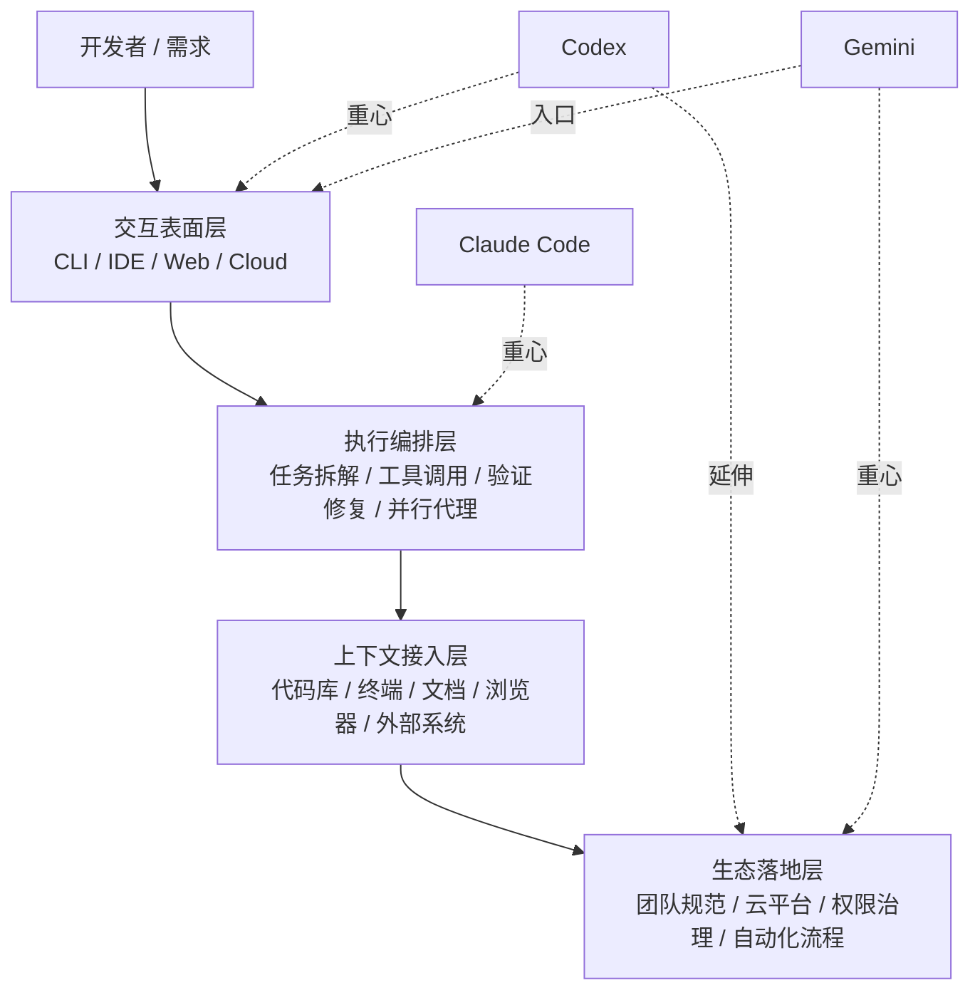

# CLI / Agent Architecture Comparison Slide Rewrite Implementation Plan

> **For agentic workers:** REQUIRED SUB-SKILL: Use plugin-A:subagent-driven-development (recommended) or plugin-A:executing-plans to implement this plan task-by-task. Steps use checkbox (`- [x]`) syntax for tracking.

**Goal:** 将 `sections/03-cli.md` 的后半部分重写为“路线 + 机制 + 例子”的架构对比页，让一线工程师能理解 Claude Code、Codex、Gemini 的不同产品路线。

**Architecture:** 保持现有静态 Markdown 驱动结构不变，只修改 `sections/03-cli.md` 的内容编排。实现重点是先用一张通用四层架构图建立统一分析坐标系，再用一张路线表与三组机制级例子说明 Claude Code、Codex、Gemini 各自把主战场压在哪一层。

**Tech Stack:** Markdown, Mermaid, static HTML deck runtime, Python `http.server`

---

## Execution Status

- Task 1：已完成，`sections/03-cli.md` 已切换为路线比较开场并插入四层 Mermaid 图
- Task 2：已完成，旧的产品介绍主结构已替换为路线对比表与三句短解释
- Task 3：已完成，已补入三家的机制级例子与工程师判断框架
- 验证：已在浏览器中打开 `http://localhost:8001/index.html` 并确认章节跳转、Mermaid 渲染、表格展示与文案结构正常
- 合并状态：已本地合并回 `main`

## File Map

- Modify: `sections/03-cli.md`
  - 责任：重写第三部分之后的内容结构，加入四层总图、三家路线表、机制级例子、工程师判断框架。
- Reference: `docs/plugin-A/specs/2026-04-08-cli-agent-architecture-comparison-design.md`
  - 责任：本次实现的设计依据。

## Validation Strategy

当前仓库没有自动化测试、lint 或构建系统，因此验证以本地运行和人工检查为主：

- 本地运行：`python3 -m http.server 8000`
- 页面检查：访问 `http://localhost:8000/index.html`
- 导航检查：点击“为什么是 CLI / Agent：真正的主战场已经变了”对应章节
- 检查项：Mermaid 图是否渲染、表格是否排版正常、文案层次是否顺、章节是否能自然衔接到下一页

### Task 1: Rewrite the architecture framing and insert the shared four-layer model

**Files:**
- Modify: `sections/03-cli.md`
- Reference: `docs/plugin-A/specs/2026-04-08-cli-agent-architecture-comparison-design.md`

- [x] **Step 1: Add the failing content checklist to execution notes**

Use this checklist before editing so the implementation has a concrete target:

```text
[ ] 第三部分开头不再直接进入产品介绍，而是先建立“路线比较”视角
[ ] 页面里出现一张通用 AI Coding Agent 四层图
[ ] 读者能先理解“为什么不是比模型，而是在比系统”
[ ] Mermaid 语法能在当前 deck 里正常渲染
```

- [x] **Step 2: Read the current section boundary before editing**

Read and locate these current headings in `sections/03-cli.md`:

```md
## 3. Claude Code / Codex / Gemini：共同点与区别
## 4. 三者各自的优势和侧重点
## 5. 三者的开发配套生态现状
```

Expected: confirm the current structure is product-introduction-heavy and does not yet establish a unified architecture frame.

- [x] **Step 3: Replace the current section-3 opening with a route-oriented framing block**

Replace the current `## 3. Claude Code / Codex / Gemini：共同点与区别` block header and its introductory text with this content:

```md
## 3. 三家都在做 Agent，但路线不一样

如果说上一代 AI Coding 的竞争重点是“谁补全得更快、更准”，  
那这一代的竞争重点已经变成：**谁更能把需求变成可执行、可验证、可交付的任务闭环。**

所以今天比较 Claude Code、Codex、Gemini，不能只看模型能力，  
而要看它们各自把主战场放在了哪一层。
```

Goal: move the chapter from feature comparison to architecture-route comparison.

- [x] **Step 4: Insert the shared four-layer Mermaid diagram immediately after the new framing block**

Insert this exact block below the new `## 3` opening:

```md
### 通用 AI Coding Agent 架构图

无论是哪一家，今天的 AI Coding agent 大体都在争四层能力：



- **交互表面层**：开发者从哪里进入 agent，比如 CLI、IDE、Web、云端任务。
- **执行编排层**：agent 怎样拆任务、调工具、跑验证、继续修复。
- **上下文与生态层**：agent 能接入哪些系统，最终能不能进入真实团队流程。

三家都在做 agent。  
区别不是“谁会不会写代码”，而是**谁把产品重心压在了哪一层**。
```

Goal: give the reader one shared model before any product-specific comparison.

- [x] **Step 5: Run the local deck and verify the new architecture framing renders correctly**

Run:

```bash
python3 -m http.server 8000
```

Expected terminal output:

```text
Serving HTTP on :: port 8000
```

Then open:

```text
http://localhost:8000/index.html
```

Expected page result:

```text
- “为什么是 CLI / Agent” 章节可以正常打开
- Mermaid 四层图成功渲染
- 新开场文案在图前出现
- 没有出现原始 mermaid 代码块文本
```

- [x] **Step 6: Commit the framing update**

```bash
git add sections/03-cli.md
git commit -m "$(cat <<'EOF'
docs: reframe CLI agent comparison around architecture layers
EOF
)"
```

### Task 2: Replace product-listing content with a route comparison table

**Files:**
- Modify: `sections/03-cli.md`
- Reference: `docs/plugin-A/specs/2026-04-08-cli-agent-architecture-comparison-design.md`

- [x] **Step 1: Remove the old product-introduction subsections after the shared diagram**

Delete or fully replace the current content under these subsections:

```md
## 4. 三者各自的优势和侧重点
## 5. 三者的开发配套生态现状
```

Expected: remove duplicate product intro text so the chapter has room for a tighter route comparison.

- [x] **Step 2: Insert the route-comparison table as the new section 4**

Insert this exact block after the shared diagram section:

```md
## 4. Claude Code / Codex / Gemini：三条不同路线

| 维度 | Claude Code | Codex | Gemini |
| :--- | :--- | :--- | :--- |
| **主战场压在哪** | 执行编排 | 多表面统一入口 | Google 生态联动 |
| **核心产品思路** | 把 agent 做成可编排开发系统 | 把 coding agent 覆盖到 CLI / IDE / Cloud | 把 coding agent 嵌进 IDE + Cloud + Google 工具链 |
| **代表性能力组织方式** | Skills / Hooks / MCP / Subagents | CLI + IDE + cloud tasks + parallel environments | Gemini CLI + Gemini Code Assist + Google Cloud |
| **一个最能说明路线差异的例子** | 子代理做 code review，hooks 拦截关键动作，MCP 拉外部上下文 | 本地提任务，云端独立环境执行，并行环境回收结果 | Cloud Shell 直接运行 CLI，BigQuery Studio / Apigee 直接调用 agent 能力 |
| **更适合解决的问题** | 流程闭环、规范沉淀、团队复用 | 跨环境一致体验、远程执行、任务分发 | 长上下文理解、云上开发、Google 生态协同 |
| **一句话理解** | 可编排代理系统 | 统一 coding agent 产品面 | 生态驱动的 coding agent |
```

Goal: compress all comparison information into one horizontally scannable table.

- [x] **Step 3: Add three short route explanations immediately below the table**

Insert this exact content below the table:

```md
- **Claude Code** 更像在做开发代理操作系统：重点不是一个入口，而是如何把能力编排成稳定工作流。
- **Codex** 更像在做统一 coding agent 产品层：重点是同一个 agent 能跨 CLI、IDE、云任务工作。
- **Gemini** 更像在做生态联动型 coding agent：重点是把 CLI、IDE、Google Cloud 串成一条开发链路。
```

Goal: help the speaker pivot from the table to spoken explanation.

- [x] **Step 4: Run the local deck and verify the table layout is readable**

Run:

```bash
python3 -m http.server 8000
```

Open:

```text
http://localhost:8000/index.html
```

Expected page result:

```text
- 表格没有错位或超出容器到不可读
- 三段解释紧跟在表格后面
- 旧的“优势/生态现状”大段重复文字已不再出现
```

- [x] **Step 5: Commit the route-table rewrite**

```bash
git add sections/03-cli.md
git commit -m "$(cat <<'EOF'
docs: replace CLI tool listing with route comparison table
EOF
)"
```

### Task 3: Add mechanism-level examples and the engineer decision frame

**Files:**
- Modify: `sections/03-cli.md`
- Reference: `docs/plugin-A/specs/2026-04-08-cli-agent-architecture-comparison-design.md`

- [x] **Step 1: Add one mechanism-level example for each product**

Insert this exact block below the three short route explanations:

```md
### 这些路线具体是怎么工作的？

- **Claude Code**：你可以把 code review 做成一个专职子代理，写完代码后自动调用 reviewer；再用 hook 拦截危险命令，最后再通过 MCP 去拿 GitHub issue 或内部文档。重点不是“它会不会回答”，而是“它能不能把规则、工具、分工编排成流程”。
- **Codex**：你在本地提一个 bug 修复任务，真正执行发生在云端独立环境里；如果有三个任务，可以扔给三个并行环境同时做，最后你回来统一审结果。重点不是“CLI 本身”，而是“统一入口 + 云端异步执行”。
- **Gemini**：Gemini CLI 可以直接在 Cloud Shell 里跑，这意味着 agent 一开始就站在云端环境里；另一边 Gemini Code Assist 还能直接出现在 BigQuery Studio 或 Apigee 这样的云产品里，直接利用表元数据、API 规范这些云侧上下文。重点不是“单一工具”，而是“把 agent 植入云控制面与产品工作流”。
```

Goal: make the chapter concrete enough that the audience can visualize each route in practice.

- [x] **Step 2: Replace the old ending with an engineer-facing decision framework**

Replace the current final summary sections with this exact block:

```md
## 5. 对工程师来说，怎么理解这三条路线

- 如果你最看重 **任务闭环、流程编排、团队沉淀**，你会更容易被 Claude Code 打动。
- 如果你最看重 **统一入口、多执行表面、云端任务协同**，Codex 会更顺手。
- 如果你最看重 **IDE + Cloud + Google 生态协同**，Gemini 会更自然。

所以这三者不是简单的高下之分，  
而是分别在回答三个不同问题：

- 怎么把 AI 变成可编排的开发代理系统？
- 怎么把 coding agent 统一铺到所有开发表面？
- 怎么把 coding agent 接进既有 IDE 与云生态？
```

Goal: end on a practical mental model instead of a product ranking.

- [x] **Step 3: Run the local deck and verify the examples improve explainability**

Run:

```bash
python3 -m http.server 8000
```

Open:

```text
http://localhost:8000/index.html
```

Expected page result:

```text
- 三家都有一个可直接口播的机制级例子
- Gemini 的云端联动不再是抽象说法，而是具体到 Cloud Shell / BigQuery Studio / Apigee
- 结尾从“总结观点”变成“工程师判断框架”
```

- [x] **Step 4: Commit the example-driven ending**

```bash
git add sections/03-cli.md
git commit -m "$(cat <<'EOF'
docs: add concrete examples to CLI agent route comparison
EOF
)"
```

### Task 4: Final review against the spec and deck behavior

**Files:**
- Modify: `sections/03-cli.md` (only if fixes are needed)
- Reference: `docs/plugin-A/specs/2026-04-08-cli-agent-architecture-comparison-design.md`

- [x] **Step 1: Read the final `sections/03-cli.md` and compare it against the spec**

Use this review checklist:

```text
[ ] 有“路线比较”开场，而不是直接产品介绍
[ ] 有通用四层图
[ ] 有路线对比表
[ ] 每家都有一个机制级例子
[ ] 结尾是工程师判断框架
[ ] 页面没有重复的大段“优势/生态现状”内容
```

Expected: every major requirement from the spec maps to visible content in the chapter.

- [x] **Step 2: Start the local server for a final rendering pass**

Run:

```bash
python3 -m http.server 8000
```

Expected terminal output:

```text
Serving HTTP on :: port 8000
```

- [x] **Step 3: Perform the final browser review of the chapter**

Open:

```text
http://localhost:8000/index.html
```

Check these exact items:

```text
- 侧边栏跳转到该章节正常
- Mermaid 图渲染成功
- 表格在页面宽度内可读
- 例子段落比表格更口语化，适合讲述
- 该页阅读后能自然衔接下一章 SDLC
```

- [x] **Step 4: Apply any final wording-only fixes needed for clarity**

If the page feels too abstract or too crowded, make only minimal wording changes inside `sections/03-cli.md`, using these guardrails:

```text
- 不新增新章节
- 不增加第二张表
- 不加入参考文献堆砌
- 只压缩或润色现有句子
```

Expected: the chapter becomes clearer without changing the approved structure.
