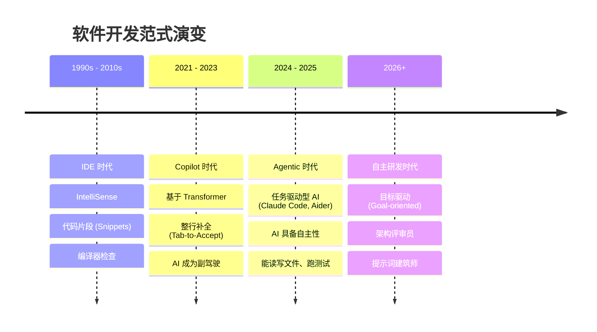

# 愿景：开发范式演进 —— 从辅助到自主

欢迎来到 2026 年的 AI Coding 时代。我们正在经历软件工程史上的第三次重大范式跳跃。

## 1. 软件工程的“十年跃迁” (Timeline)

我们如何从“手写每一行代码”演进到今天的“指挥 AI 完成任务”？

## 2. 核心认知的“三大转变” (Core Shifts)

### A. 从过程关注 (How) 到 结果关注 (What)
- **过去**: 开发者的大部分精力消耗在“如何实现这个循环”、“如何配置这个 Webpack”。
- **现在**: 我们只需要清晰地定义“我们要构建什么”。AI 负责填补实现细节，开发者负责校验结果。

### B. 专注流的回归 (Flow State)
为什么我们今天依然推崇 **CLI (命令行)**？
- **减少上下文切换**: 离开 IDE 的 GUI 插件，回归终端。在终端里，AI、Git、测试工具、构建脚本都在同一个层级，形成极简的闭环。
- **原子化操作**: 通过 CLI 指令，你可以像组合 Lego 积木一样组合 AI 的能力，而不是在图形界面里点点点。

### C. 质量保证的“前置化” (TDD Revived)
在 AI 时代，**TDD (测试驱动开发)** 焕发了第二春。
- **AI 怕什么?**: AI 最怕没有反馈。
- **最佳实践**: 先用自然语言描述测试用例 -> AI 自动编写测试 -> AI 运行测试并失败 -> AI 编写实现代码 -> 测试通过。**这个闭环是 AI 时代交付质量的基石。**

## 3. 2026 年开发者的核心竞争力 (Competency)

> "AI 不会取代程序员，但使用 AI 的程序员会取代不使用的人。"

| 维度 | 传统开发者 | AI 赋能型开发者 (2026) |
| :--- | :--- | :--- |
| **主要工作** | 敲代码 (Coding) | 架构设计 & 逻辑评审 (Reviewing) |
| **核心技能** | 熟悉语法 API | 任务分解与 Prompt 工程 |
| **提效点** | 打字速度、搜索技巧 | 流程编排、AI 工具链组合 |
| **产出物** | 代码行数 (LOC) | 交付的价值与系统稳定性 |

---

> **结语**: 我们不再是代码的搬运工，而是复杂系统的设计师。保持好奇，掌握指令，开启你的 AI 驱动研发之旅。
