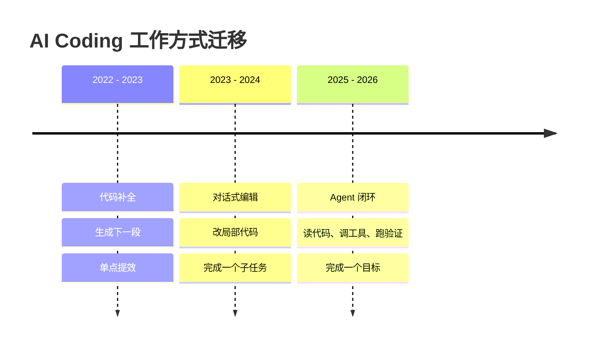

# 为什么是现在：AI Coding 正在从辅助走向闭环

这一页只回答一个问题：为什么 2026 年值得专门讲 AI Coding，以及为什么现在必须开始理解它背后的执行底座。

## 1. 工作方式迁移

过去几年，AI 编程经历了非常清晰的能力跃迁。

### 这次变化真正改变了什么
- **交互对象变了**：从“补一段代码”变成“完成一个目标”。
- **反馈链路变了**：AI 不再只输出文本，而是开始依据测试、日志、命令结果继续行动。
- **竞争焦点变了**：真正拉开差距的，不再只是模型，而是能不能把模型接进真实系统的 harness。
- **开发者角色变了**：人从手工实现者，逐步转向目标定义者与结果验收者。

## 2. 分享目标

今天不想把内容做成工具说明书，而是回答三件事：
- **第一**：AI Coding 到底变到了哪个阶段。
- **第二**：为什么 Agent、Harness 和 CLI 会成为主战场。
- **第三**：团队怎样把这种能力真正放进研发流程里，而不是停留在 demo。

## 3. 讲述路径

这套分享会按下面的顺序推进：
1. **先看模型层**：国内外大模型的性能、费用和使用边界怎么判断。
2. **先看产品与执行体系**：看 Claude Code、Codex、Gemini 分别把重心放在哪一层。
3. **再拆调用链路与执行机制**：把 Agent、Harness、Hook、MCP、LSP 放进同一张运行时图里。
4. **再补一个实操工具**：CC Switch 这类个人 AI 工作台中枢，为什么会在长期使用阶段变重要。
5. **再补一页高频技巧**：Claude Code 有哪些真正能提升日常效率的使用习惯。
6. **再讲研发闭环**：需求如何变成计划、实现、验证和交付。
7. **最后收束到角色演进**：当 AI 进入闭环之后，开发者的职责会怎么变化。

---

> 这场分享的重点不是“AI 会不会写代码”，而是“AI 是否已经开始参与真实交付”。