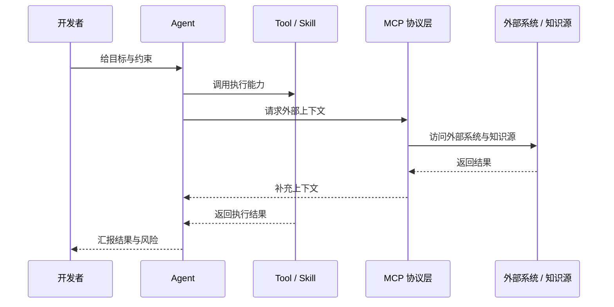

# 最小术语表：只讲后面一定会用到的概念

这一页不是百科全书，而是为了让后面的流程演示更容易听懂。

## 1. 一张图看清层级关系

## 2. 五个最小概念

### LLM
- 底层模型能力，负责理解、推理与生成。
- 它是底座，不直接等于某个具体产品形态。

### Agent
- 面向完整任务执行的产品形态。
- 会规划、会调用工具、会根据反馈继续行动。

### Tool / Skill
- Agent 真正拿来“动手”的能力接口。
- 比如读文件、写文件、执行命令、搜索、提问。

### MCP
- 把外部工具、知识库、系统能力接进来的协议层。
- 它不是另一个技能，而是“让外部能力可被 Agent 使用”的连接方式。

### Context
- 指 Agent 做决策时真正看到的信息总量。
- 包括当前代码、历史对话、外部检索结果、系统反馈等。

## 3. 两组容易混淆的对照

### LLM vs Agent
- **LLM**：底层脑力
- **Agent**：带执行链路的产品形态

### RAG vs Long Context
- **RAG**：按需去外部找资料再喂给模型
- **Long Context**：一次性把更多上下文直接放进模型
- **一句话理解**：RAG 解决“去哪里找”，Long Context 解决“能一次看多大”

## 4. 一句话记忆
- **Agent**：帮你完成一件事
- **Tool / Skill**：AI 动手的接口
- **MCP**：AI 连接外部世界的协议
- **Context**：AI 做判断时真正看到的信息