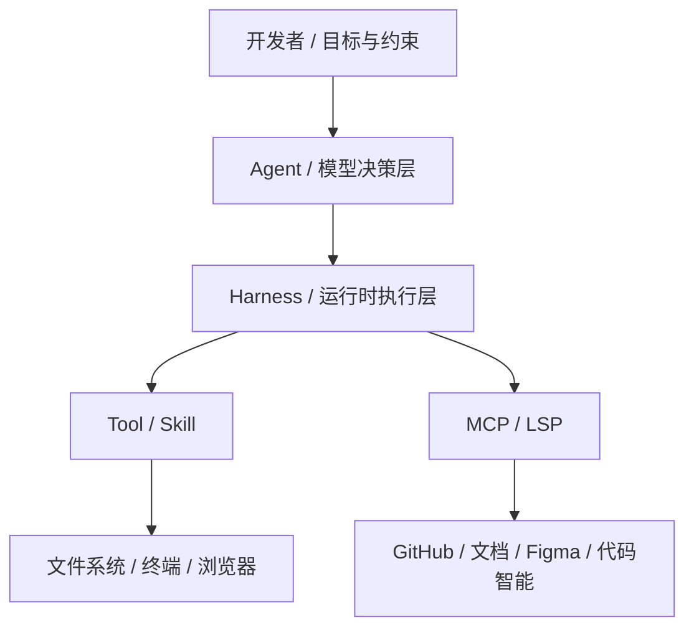

# 最小术语表：只讲后面一定会反复出现的概念

这一页不是百科全书，而是为了让后面的 CLI、Agent、研发闭环和治理章节更容易听懂。

这次把 **harness** 放进来，因为后面很多差异已经不只是模型差异，而是执行层差异。

## 1. 一张图先看清分层

- **一句话理解**：模型负责“想”，harness 负责“把动作安全、稳定、可控地做出来”。

## 2. 七个最小概念

### LLM
- 底层模型能力，负责理解、推理与生成。
- 它决定“下一步可能该做什么”，但不直接等于完整产品形态。

### Agent
- 面向完整任务执行的智能体形态。
- 会拆步骤、调工具、根据反馈继续行动。

### Harness
- 把模型、工具、权限、上下文、插件和外部系统串起来的运行时执行框架。
- 它决定 AI **能做什么、怎么做、做到哪一步、哪些动作必须被限制**。

### Tool / Skill
- **Tool** 是 AI 真正“动手”的接口，比如读文件、改文件、执行命令、搜索代码。
- **Skill** 更像封装好的工作流模板，比如写计划、系统化调试、代码评审、TDD。

### MCP
- 把外部工具、知识库、系统能力接进来的协议层。
- 它不是另一个技能，而是“让外部能力可被 Agent 使用”的连接方式。

### LSP
- 面向代码智能的协议层。
- 主要负责跳转定义、查找引用、类型信息、符号搜索这类代码理解能力。

### Context
- 指 Agent 做决策时真正看到的信息总量。
- 包括当前代码、历史对话、规则、memory、外部检索结果、系统反馈等。

## 3. 四组最容易混淆的对照

### LLM vs Agent
- **LLM**：底层脑力
- **Agent**：带执行链路的任务执行者

### Agent vs Harness
- **Agent**：更像“智能执行者”，强调目标、决策、多步行动
- **Harness**：更像“运行时底座”，强调工具接入、权限控制、上下文管理和执行编排
- **一句话理解**：agent 像司机，harness 像车、路、规则和仪表盘

### Tool / Skill vs MCP / LSP
- **Tool / Skill**：AI 直接拿来执行动作的方法
- **MCP**：连接外部系统与知识源的协议层
- **LSP**：连接代码语言智能的协议层

### RAG vs Long Context
- **RAG**：按需去外部找资料再喂给模型
- **Long Context**：一次性把更多上下文直接放进模型
- **一句话理解**：RAG 解决“去哪里找”，Long Context 解决“能一次看多大”

## 4. 再补一个常被混用的词：Workflow / Framework / Harness

- **Workflow**：做事顺序，比如先搜代码、再写测试、再修改实现、最后验证
- **Framework**：开发结构与抽象规范，比如 Web framework、Agent framework、插件框架
- **Harness**：把 workflow、tools、rules 和外部系统真正组织成可执行系统的运行层

## 5. 放到 Claude Code 语境里怎么理解

- **Claude 模型**负责思考、推理、决定下一步。
- **Claude Code 运行环境**本身就是 harness，也就是把模型决策变成可执行、可控动作的运行时执行层。
- 其中 **skills、hooks、subagents** 更像运行时内的能力组织方式；**MCP servers、LSP servers** 更像外部系统与代码智能的协议接入层。

## 6. 一句话记忆

- **Agent**：帮你完成一件事
- **Harness**：让这件事真的能安全做成
- **Tool / Skill**：AI 动手的接口与工作流模板
- **MCP / LSP**：连接外部系统与代码智能的协议层
- **Context**：AI 做判断时真正看到的信息