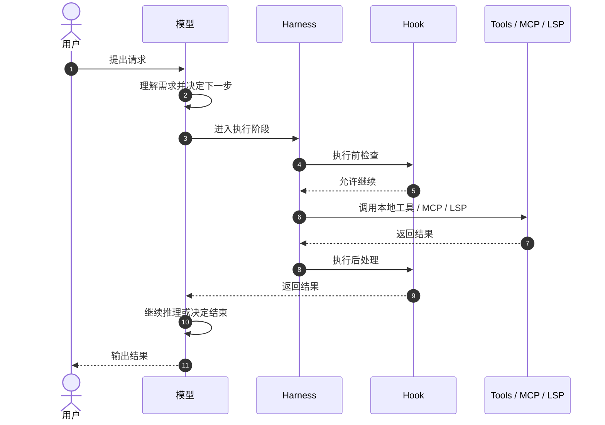
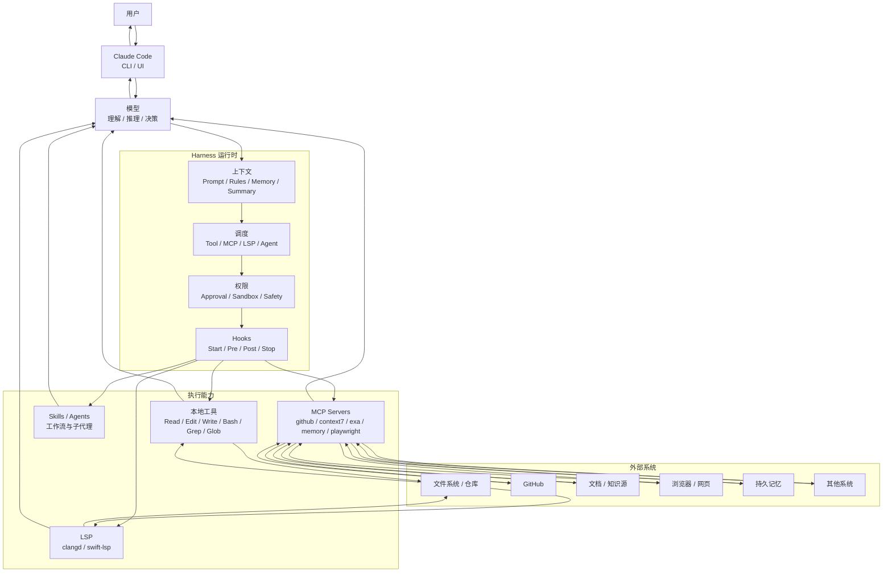
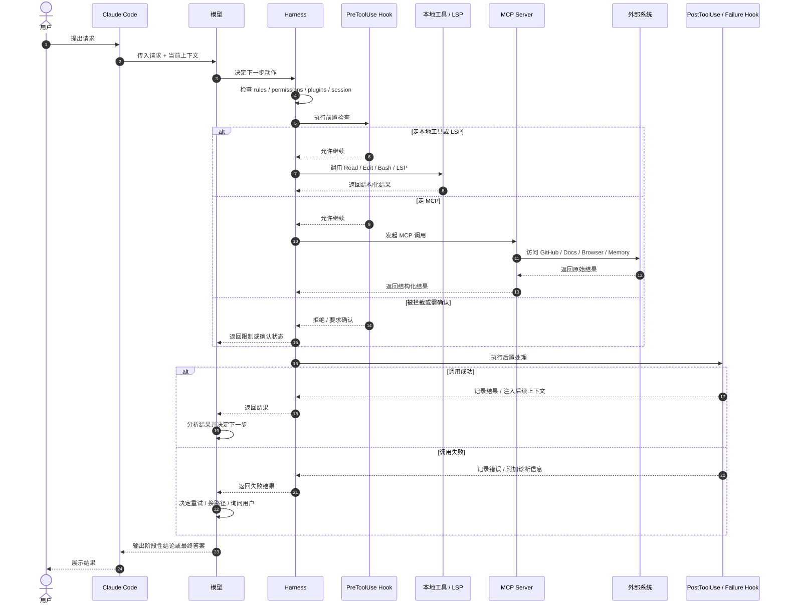
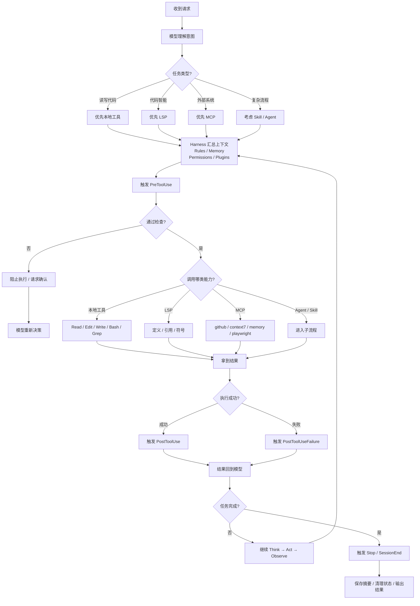
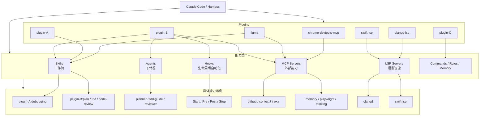
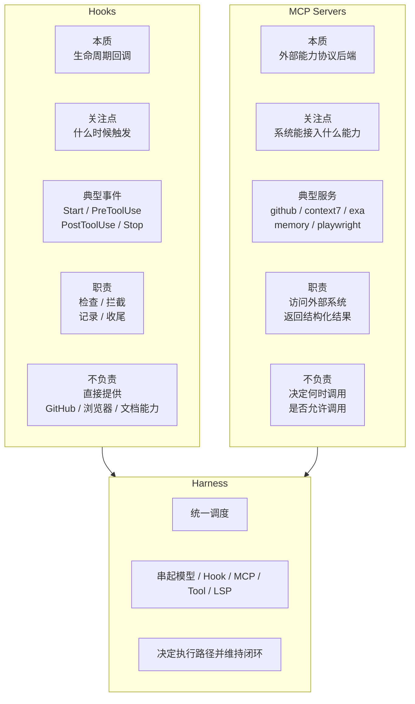
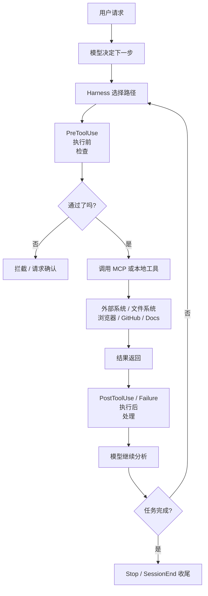
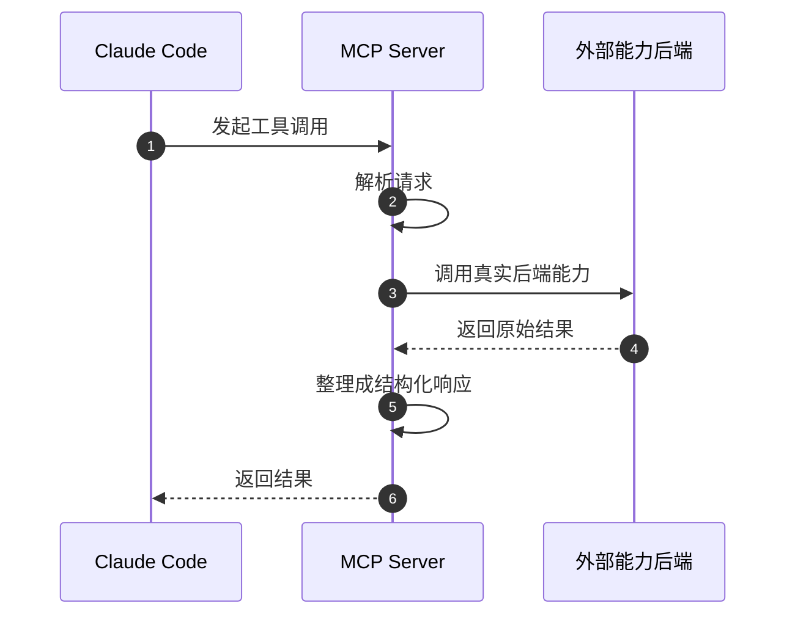
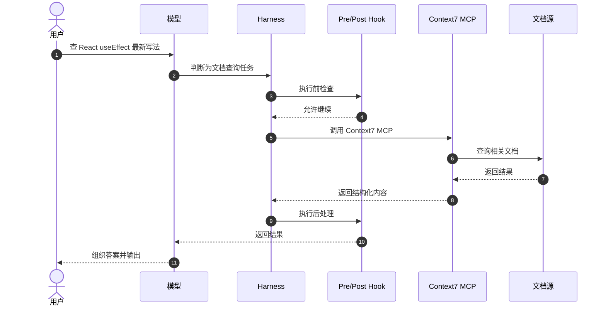
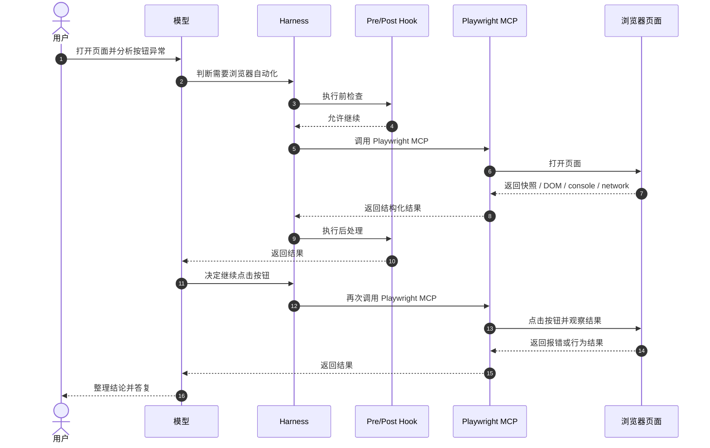

# 调用链路与执行机制：Hooks、MCP 与 Harness

## 前言

上一章已经先讲清楚：为什么今天真正的竞争，不再只是模型强弱，而是产品如何把 Agent、Harness 和执行入口组织成系统。

接下来再往里拆：在 Claude Code、Agent Runtime、AI Coding、MCP 这些语境里，很多人会同时看到这些概念：

- Hooks
- MCP Servers
- Tools
- LSP
- Harness

它们经常一起出现，但各自扮演的角色并不一样。

先看最核心的分工：

- **Hooks** 负责“在关键时机自动做什么”
- **MCP Servers** 负责“系统可以连接哪些外部能力”
- **Harness** 负责“把模型、规则、工具、MCP、上下文组织成一个可运行的执行闭环”

这份文档的重点，是把它们之间的运行关系讲清楚。

---

## 一、先给出一个总览

一条典型的 Claude Code 执行链路，更适合用时序图来理解：

这个图里最重要的一点是：

- 模型在决定“下一步做什么”
- Harness 在决定“这一步怎么安全地做成”
- Hooks 在关键时机自动介入
- MCP Servers 在需要时提供外部能力

### Mermaid 图 1：整体分层与组件关系

### Mermaid 图 2：一次完整请求的时序图

### Mermaid 图 3：Harness 的决策流与分支路径

这些图可以配合正文一起看：

- 图 1 适合看“分层和组件关系”
- 图 2 适合看“一次请求到底怎么流转”
- 图 3 适合看“Harness 是如何分支决策与循环执行的”

### Mermaid 图 4：Claude Code 插件生态映射图

### Mermaid 图 5：Hook 与 MCP 的职责对比图

### Mermaid 图 6：Hook 与 MCP 在一次调用中的协作位置

这 3 张新增图分别适合：

- 图 4：讲清 Claude Code 里“插件 → 能力层 → 具体能力”的映射关系
- 图 5：快速解释 Hook 和 MCP 不是一类东西
- 图 6：直观看 Hook 和 MCP 在一次调用里各自处在什么位置

---

## 二、第一层：用户发出请求

执行链路总是从用户请求开始。

例如：

- 帮我查这个 PR
- 帮我看 React 最新文档
- 帮我打开网页看看哪里报错
- 帮我记住以后默认中文回复

这时系统拿到的是一个目标，而不是某个固定的技术命令。

模型首先需要做的是理解意图。

---

## 三、第二层：模型做决策

模型会先判断当前问题属于哪一类任务。

例如：

- 是解释类任务，还是执行类任务？
- 是需要读代码，还是查文档？
- 是需要浏览器，还是需要 GitHub？
- 是需要长期记忆，还是只要当前会话内处理？
- 是一步能完成，还是必须拆成多步流程？

这里模型真正负责的是：

- 理解目标
- 选择下一步策略
- 决定要调用什么能力

这一步很重要，因为后续一切执行，都是从这里的“下一步动作决策”展开的。

不过需要注意的是：

> 模型可以决定“我想调用某种能力”，但并不等于它就能直接执行；真正负责把这件事安排下去的，是 harness。

---

## 四、第三层：Harness 进入调度阶段

当模型决定下一步动作后，Harness 会开始接管执行层逻辑。

它通常会综合这些因素：

- 当前有哪些本地工具可用
- 当前加载了哪些 plugins
- 当前连接了哪些 MCP servers
- 当前有哪些 LSP servers
- 当前 rules、permissions、hooks 是什么
- 当前会话是否有相关上下文、记忆、摘要

Harness 会基于这些条件，判断：

- 这个动作能不能做
- 应该走哪条能力路径
- 是否需要先经过 hook 检查
- 是否要请求用户授权
- 是否应该优先走 MCP、LSP 还是本地工具

所以 harness 不是一个单点功能，而是一整层执行控制与调度机制。

---

## 五、第四层：PreToolUse Hook 先介入

在真正调用工具前，系统里常常会先触发 `PreToolUse` Hook。

这是“执行前守门”的关键阶段。

### 它通常用来做什么

- 检查这次调用是否危险
- 检查参数是否合法
- 检查是否违反当前规则
- 检查是否需要额外提醒
- 根据环境动态补充约束信息

### 一个典型例子

如果模型决定执行某个 shell 命令：

1. 模型提出调用意图
2. Harness 准备执行 `Bash`
3. `PreToolUse` Hook 先触发
4. Hook 可以检查：
   - 这是不是 destructive command
   - 是否需要权限确认
   - 是否命中了用户配置的风险策略
5. 只有通过后，工具调用才真正发生

所以 `PreToolUse` 的角色不是“提供能力”，而是：

> 在动作真正发生前，替系统做一次自动化审查和拦截。

这也是为什么 hooks 对安全性非常关键。

---

## 六、第五层：真正调用能力提供者

通过前置检查后，系统才会真正调用能力。

这一步大体有三类路径。

### 1. 调用本地内建工具

例如：

- `Read`
- `Edit`
- `Write`
- `Bash`
- `Grep`
- `Glob`

这类工具通常由 Claude Code 原生提供。

它们更偏本地执行层能力。

### 2. 调用 MCP Server

例如：

- GitHub MCP
- Context7 MCP
- Exa MCP
- Memory MCP
- Playwright MCP
- Sequential Thinking MCP

这类能力不是 Claude Code 自己原生“懂”的，而是通过 MCP 协议接进来的。

Harness 会把请求转交给相应 MCP server，由 MCP server 真正去执行。

### 3. 调用 LSP Server

例如：

- `clangd`
- `swift-lsp`

这类主要是语言智能，用于代码导航、类型信息、符号检索等。

它不太像外部任务执行能力，更像代码理解辅助层。

---

## 七、第六层：MCP Server 内部是怎么工作的

当某一步走的是 MCP 路径时，用时序图来看会更清楚：

这意味着：

- Claude Code 本身不直接实现所有第三方能力
- 它通过 MCP 把这些能力标准化接进来
- MCP server 是协议适配器，也是能力执行后端

### 示例 1：GitHub MCP

如果模型要查看某个 PR：

1. Harness 调用 GitHub MCP 对应工具
2. GitHub MCP server 去访问 GitHub API
3. 获取 PR 数据、评论、状态、文件列表等
4. 整理成结构化结果返回
5. Claude Code 再把结果交给模型继续分析

### 示例 2：Context7 MCP

如果模型要查某个库的最新文档：

1. Harness 调用 Context7 工具
2. Context7 server 查询文档源
3. 返回与当前问题最相关的文档内容或代码示例
4. 模型再基于这些结果组织答案

### 示例 3：Playwright MCP

如果模型要打开网页、点击按钮、截图：

1. Harness 调用 Playwright MCP
2. Playwright server 驱动浏览器执行动作
3. 返回快照、截图、DOM、控制台输出、网络请求等信息
4. 模型据此继续判断下一步

所以 MCP server 的本质，可以理解为：

- 外部能力执行代理
- 标准协议下的工具后端
- 模型世界与外部系统之间的能力网关

---

## 八、第七层：工具调用结束后，Hook 再次介入

无论调用的是本地工具还是 MCP，执行结束之后，系统通常还会再次触发 hook。

分成两种：

- `PostToolUse`：工具调用成功
- `PostToolUseFailure`：工具调用失败

### 成功后常见的动作

- 自动记录结果
- 自动补充上下文
- 自动触发后续检查
- 提醒下一步建议
- 做格式化或总结

### 失败后常见的动作

- 附加错误分析提示
- 自动保存失败信息
- 为后续恢复流程提供上下文
- 告诉系统这是权限问题、参数问题还是环境问题

因此可以把这一层理解成：

> 工具执行后的“后处理层”和“恢复辅助层”。

---

## 九、第八层：结果回到模型，进入下一轮推理

这一步是 agent-like 系统最关键的闭环。

工具不会自己完成整个任务。

真正的工作模式通常是：

1. 模型决定下一步动作
2. Harness 执行动作
3. 系统拿到结果
4. 结果返回给模型
5. 模型基于结果继续判断下一步

这个循环经常被概括为：

- Think
- Act
- Observe
- Think again

也就是说，模型并不是“一次性想完整个任务”，而是在不断根据观察结果迭代。

Harness 的作用，就是把这个循环稳定地组织起来。

---

## 十、第九层：Stop / SessionEnd Hook 做收尾

在一轮任务即将结束或整个会话结束时，其他 hook 还会介入。

常见有：

- `Stop`
- `SessionEnd`
- 有时还会有 `PreCompact`

### 这些 hook 一般做什么

- 最终检查
- 保存状态
- 生成会话摘要
- 清理临时上下文
- 为下一次会话准备信息

比如你看到某些系统能够自动带回上次会话摘要，本质上通常就是：

- 上一轮结束时有收尾 hook 运行
- 它把关键信息整理并保存了下来
- 下一次会话再通过 `SessionStart` 注入回来

这就形成了跨轮次的记忆与状态延续。

---

## 十一、Hooks 到底是什么：本质定位

很多人第一次看到 hooks，会误以为它是一种 agent 或 skill。

其实不是。

### Hooks 的本质

Hooks 是**事件驱动的自动化机制**。

它不是“会思考的角色”，也不是“主动规划任务的 agent”。

它更像：

- Git hooks
- 中间件回调
- 生命周期回调
- 自动化拦截器

### 你当前看到的典型 hooks 事件

- `SessionStart`
- `PreToolUse`
- `PostToolUse`
- `PostToolUseFailure`
- `PreCompact`
- `Stop`
- `SessionEnd`

### 这类 hook 的核心价值

- 把系统规则前置化
- 把自动化行为工程化
- 减少对模型“记得住一切规则”的依赖
- 用运行时机制补强一致性和安全性

核心结论是：

> Hook 不是增加系统智力，而是增加系统纪律性。

---

## 十二、MCP 到底是什么：本质定位

MCP 是 **Model Context Protocol**。

它可以理解成：

> 一套让 Claude Code 这类运行环境，能够标准化连接外部工具与系统的协议层。

### MCP 的核心作用

- 统一工具接入方式
- 降低第三方能力集成成本
- 让模型调用外部工具时保持结构一致
- 提升扩展性和可组合性

### MCP Server 的核心角色

MCP server 不是大模型本身，也不是 UI。

它更像：

- 一个对外暴露工具能力的进程
- 一个协议实现者
- 一个外部能力适配层

Claude Code 通过它，获得：

- GitHub 能力
- 文档检索能力
- 网页搜索能力
- 持久记忆能力
- 浏览器自动化能力
- 结构化思考辅助能力

MCP server 的核心定位是：

> MCP server 是让 harness 拿到外部能力的标准工具后端。

---

## 十三、Hooks 和 MCP 的根本区别

这两者虽然经常一起出现，但职责完全不同。

### Hooks 更关心“时机”

它回答的问题是：

- 在什么时候自动做点什么？
- 在动作前后要不要拦截、校验、收尾？

### MCP 更关心“能力”

它回答的问题是：

- 系统到底能访问什么外部能力？
- 这些能力通过什么协议暴露给 harness？

可以这样记：

- Hook = 生命周期控制
- MCP = 外部能力提供者

它们经常会配合，但不在同一层。

例如一条真实链路可能是：

1. 模型决定调用 GitHub 能力
2. `PreToolUse` hook 先检查这次调用
3. Harness 调用 GitHub MCP
4. GitHub MCP 真正访问 GitHub
5. 返回结果
6. `PostToolUse` hook 再进行收尾或记录

所以：

- Hook 在管流程边界
- MCP 在提供工具能力

---

## 十四、再用一个具体例子串起来

我们用两个场景分别说明。

### 场景一：查文档

用户说：

> 帮我查 React `useEffect` 的最新官方写法

系统链路可以改成一张更适合演示的时序图：

### 场景二：查网页问题

用户说：

> 帮我打开页面看看为什么按钮点不了

系统链路可以改成一张更直观的时序图：

这两个例子能很好地说明一件事：

- Hook 不是干活的人
- MCP 不是做决策的人
- Harness 不是具体外部系统
- 模型也不是自己直接操作浏览器或 GitHub

它们是一起协作的。

---

## 十五、核心结论

如果要把这整套关系压缩成一句话，最推荐记住的是：

> Hook 决定“在什么时候自动检查或处理”，MCP 决定“系统能调用哪些外部能力”，Harness 则把模型、Hooks、MCP、工具和上下文组织成一个可持续运行的执行闭环。

这是理解 Claude Code、Agent Runtime、MCP 工具链时最核心的一句话。

---

## 十六、一个超简版分工图

最后给出一个最方便记忆的极简版本：

  

    
模型

    
决定下一步

  

  

    
Hooks

    
在关键时机自动干预

  

  

    
Harness

    
统一调度与控制

  

  

    
MCP

    
提供外部能力

  

  

    
LSP

    
提供代码智能

  

  

    
Tools

    
执行具体动作

  

这张图把几个最容易混淆的角色放到了同一张分工图里。

---

## 十七、总结

在现代 AI coding 和 agent 系统里，真正重要的不是单个能力点，而是整条执行链路是否稳定、可控、可扩展。

从这个角度看：

- Hooks 让系统具备纪律性和自动化边界
- MCP 让系统具备外部能力连接性
- Harness 让整套机制形成闭环并可持续运行

所以当你看到：

- `PreToolUse`
- `PostToolUse`
- `SessionStart`
- `github`
- `context7`
- `playwright`
- `memory`

这些名字时，不要把它们看成孤立的功能点。

更贴近运行机制的理解是：

> 它们都是同一套 harness 执行体系中不同层次的组件，各自负责不同的职责，但共同支撑了模型从“思考”走向“行动”的过程。

理解完这套调用链路后，再去看 CC Switch 这类配置中枢，就更容易明白：它管理的不是单个模型，而是整套 AI Coding 执行环境。 