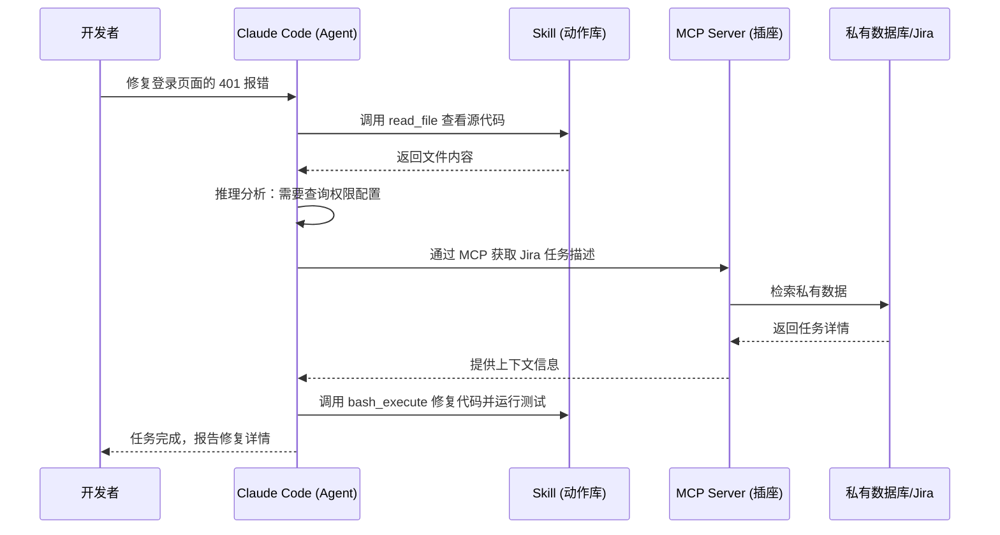

# 深度：核心术语全解析

理解 AI Coding，首先要对齐这几个关键维度的架构关系。

## 1. 核心架构关系图 (Architecture)

通过这个时序图，我们可以看到用户指令是如何通过 Agent 调动不同 Skill 最终通过 MCP 连接私有数据的。

## 2. 深度对比：从补全到执行

| 维度 | **AI Copilot** (助手) | **AI Agent** (智能体) |
| :--- | :--- | :--- |
| **交互逻辑** | 预测下一个 Token | 目标驱动的任务流 |
| **执行边界** | 仅限于 IDE 编辑区 | 具备 Shell/网络/文件权限 |
| **自主程度** | 被动补全 | 主动发现错误、尝试、纠正 |
| **代表工具** | Github Copilot, Cursor | **Claude Code**, Aider |

## 3. 什么是 Skill？
Skill 是 AI 的“手”，它是**原子化**的接口定义。
- **内置 Skill**: `read_file`, `write_file`, `run_command`
- **扩展 Skill**: 通过 MCP 协议，任何 API 都可以被封装成 AI 的一个 Skill。

## 4. 什么是 MCP (Model Context Protocol)？
这是 Anthropic 提出的开放协议。它打破了数据的孤岛。
- **解耦**: 开发者只需要写一个符合协议的 Server。
- **通用**: 无论是哪个 LLM，只要支持 MCP，都能立刻读懂你的私有数据。
