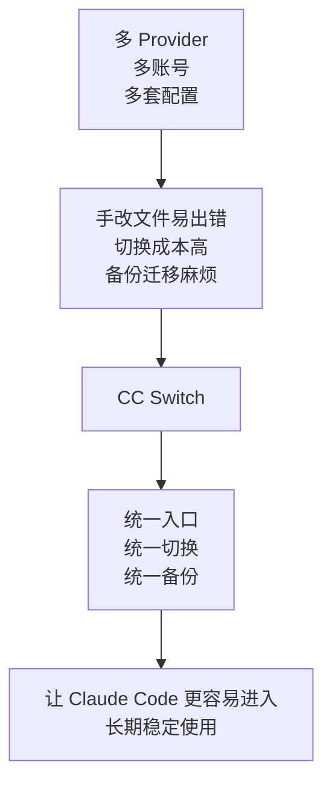
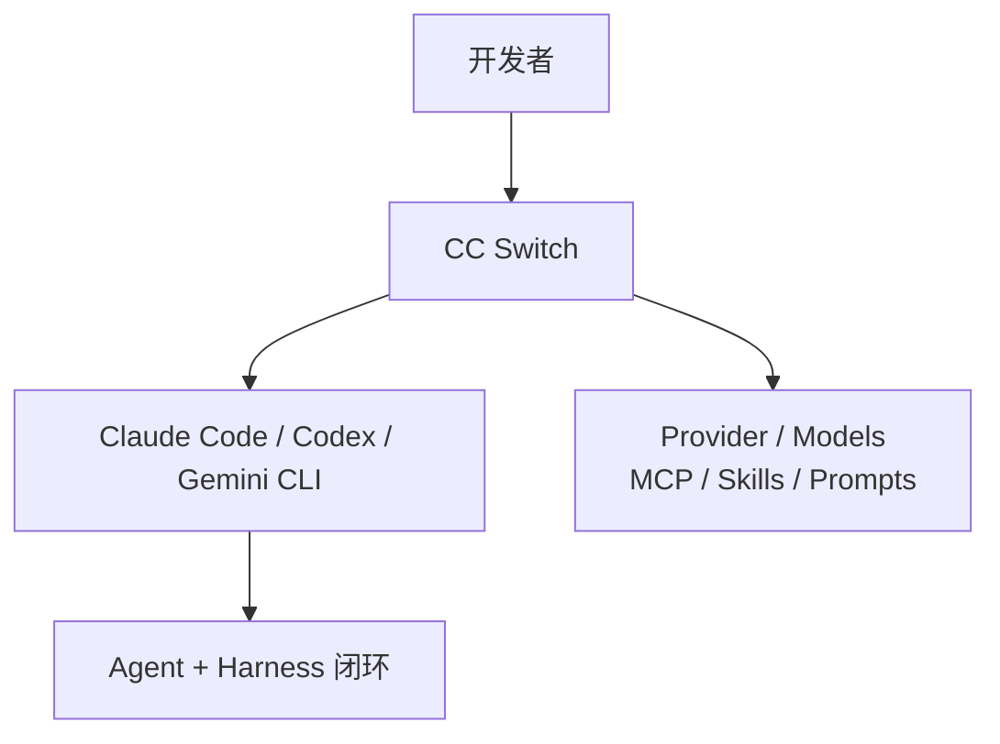
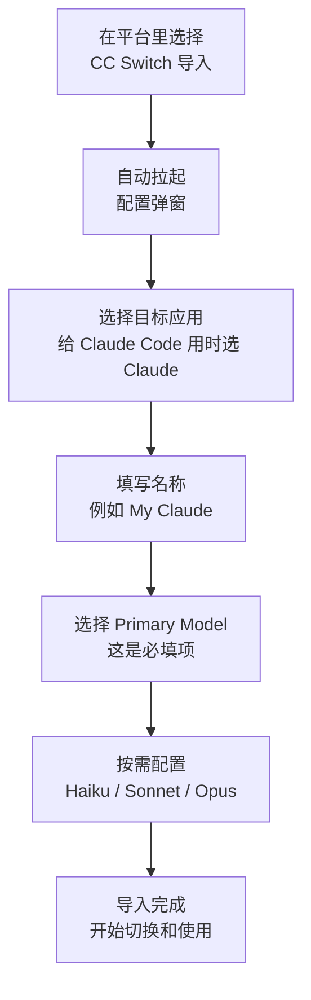
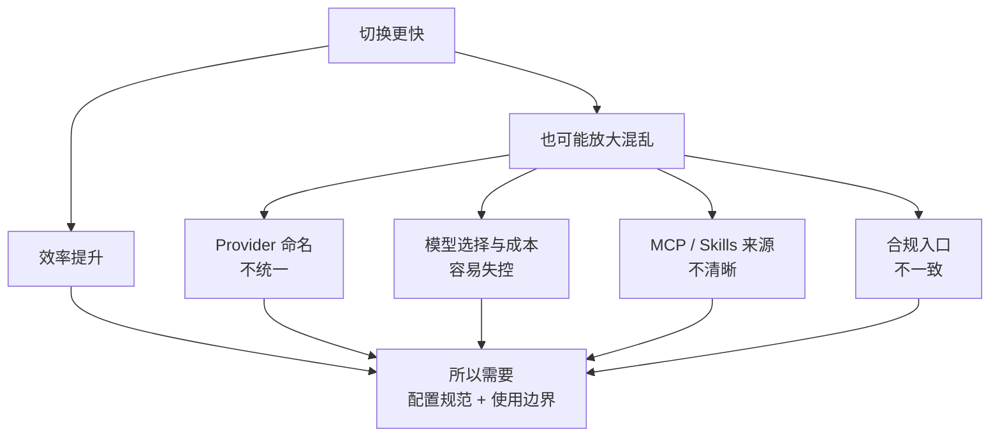

# CC Switch：把 Claude Code 真正用顺手的配置中枢

前面讲的是 Agent、Harness 和 CLI 为什么重要；这一页讲一个很实用的落地工具：**CC Switch**。

它的定位可以概括为：

> CC Switch 不是另一个模型，也不是另一个 Agent；它更像是管理 Claude Code 等 AI CLI 配置、Provider、MCP、Skills 的统一控制台。

## 1. 核心问题

很多团队在真正开始用 Claude Code 之后，最先遇到的不是“模型不够强”，而是配置越来越乱：

- 不同人接不同 Provider
- 同一个人要在官方账号、代理、聚合网关之间来回切
- MCP、Skills、Prompt 预设分散在不同目录
- 手改 JSON / TOML / `.env` 容易出错
- 想回滚配置、备份配置、迁移配置都很麻烦

这类问题，本质上不是模型问题，而是 **CLI 配置管理问题**。

CC Switch 的价值，就是把这些分散动作收敛成一个统一入口。



## 2. 在整套体系里的位置



- **Claude Code** 是执行环境，是 harness 的一部分。
- **CC Switch** 不是用来替代 Claude Code，而是用来管理它周边那层配置与接入能力。
- 它特别适合在多 Provider、多环境、多工具并存时，降低切换和维护成本。

## 3. 它的核心优势

### A. 统一管理多个 AI CLI
- 不只管 Claude Code，还能一起管理 Codex、Gemini CLI 等工具。
- 对团队来说，这意味着“多工具并存”不再等于“每个工具单独折腾一套配置”。

### B. 减少手改配置文件的风险
- 把原本分散在 JSON、TOML、`.env` 里的配置改成可视化管理。
- 对经常切换 Provider、模型和代理的人来说，明显比手工改文件稳。

### C. 适合多 Provider / 多账号切换
- 可以维护不同的 Provider 配置、模型组合和账号入口。
- 适合官方账号、代理服务、聚合网关并存的场景。

### D. MCP / Skills / Prompt 一起管理
- 不只是切模型，还能统一管理 MCP、Skills、Prompts。
- 这点很重要，因为真正影响团队复用效率的，往往不是 API Key，而是整套工具链配置。

### E. 备份、恢复、迁移更方便
- 文档强调它有自动备份、原子写入和统一的数据目录。
- 对团队推广来说，这意味着更容易迁移机器，也更容易从错误配置中恢复。

### F. 对 Claude Code 使用体验友好
- 官方说明里明确提到：**Claude Code 当前支持热切换 Provider 数据，不需要重启。**
- 这使它在 Claude Code 场景下的切换体验比很多 CLI 更顺。

## 4. 适用场景

### 很适合的场景
- 你经常在多个 Provider 之间切换
- 你同时用 Claude Code、Codex、Gemini CLI
- 你已经开始用 MCP、Skills、Prompt 预设
- 你想让团队减少“每个人自己改一套本地配置”的混乱
- 你希望统一管理模型、代理、配置和备份

### 不一定非要上的场景
- 你只用 Claude 官方默认配置
- 你几乎不切模型、不切 Provider、不接 MCP
- 你当前使用方式很轻，手工配置成本还很低

阶段判断是：

> 当你的 AI Coding 从“偶尔试用”进入“长期使用、多配置并存”阶段，CC Switch 的价值会明显上升。

## 5. 怎么安装

### macOS
```bash
brew tap farion1231/ccswitch
brew install --cask cc-switch
```

更新：

```bash
brew upgrade --cask cc-switch
```

### Windows
- 安装包：`CC-Switch-v{version}-Windows.msi`
- 便携版：`CC-Switch-v{version}-Windows-Portable.zip`

### Linux
- Arch / paru：`paru -S cc-switch-bin`
- 也提供：`.deb`、`.rpm`、`.AppImage`

## 6. 常见用法

### 方式一：作为本地统一配置面板
最常见的用法不是“天天盯着它”，而是把它当成：

- Claude Code 的 Provider 切换器
- 模型组合配置器
- MCP / Skills / Prompt 的管理面板
- 配置备份与恢复入口

你真正日常工作的地方仍然是 Claude Code；CC Switch 更像后台配置中枢。

### 方式二：导入现有配置后统一管理
文档里提到，首次启动时可以导入已有 CLI 配置作为默认 Provider。

这意味着你不用从零重配，比较适合：
- 已经在用 Claude Code
- 只是想把分散配置收回来统一管理

### 方式三：通过集成入口导入配置
像 MoleAPI 这类平台，会提供直接导入到 CC Switch 的入口。典型流程是：

1. 在平台的 Token 管理页选择 `CC Switch`
2. 自动拉起 CC Switch 配置弹窗
3. 选择目标应用（给 Claude Code 用时选 `Claude`）
4. 填写名称，例如 `My Claude`
5. 选择 `Primary Model`
6. 如有需要，再选 `Haiku / Sonnet / Opus` 对应模型
7. 点击 `Open CC Switch` 完成导入



## 7. 使用边界

### 边界 1：它是配置管理器，不是能力替代品
- CC Switch 不会替你完成编码任务。
- 真正执行任务的仍然是 Claude Code 这类 CLI。
- 它提升的是“切换效率、配置稳定性、接入治理能力”。

### 边界 2：不要把“切得快”误解成“随便切”
- 不同 Provider 的稳定性、速率限制、模型路由可能不同。
- 切换更容易了，不代表切换成本真的消失。
- 切换效率提升之后，配置纪律同样重要。

### 边界 3：模型一定要选对
- `Primary Model` 是必填项。
- 如果没选，界面会提示 `Please select a model`。
- 最好把常用模型与高成本模型分层配置清楚，避免把昂贵模型默认挂到所有场景。

### 边界 4：理解“热切换”的边界
- 多数 CLI 在切换后仍需要重启终端或对应工具。
- **Claude Code 当前支持热切换 Provider 数据，无需重启。**
- 但如果你同时改了 MCP、Prompt、Skills 或外部代理链路，最好仍做一次最小验证。

### 边界 5：当前激活配置不能直接删
- 文档说明当前激活的 Provider 不能直接删除。
- 这其实是好事：能减少误删当前工作配置的风险。

### 边界 6：回到官方配置要按流程来
- 如果你想从第三方 Provider 切回 Claude 官方配置，不是简单“删掉旧配置”就行。
- 官方文档建议先添加官方预设，再走登出 / 登录流程。

### 边界 7：它管得越多，越要有基本命名规范
建议至少统一：
- Provider 命名
- 环境命名（个人 / 团队 / 测试）
- 模型分层命名

否则工具越强，个人与小团队配置越容易长成另一种混乱。



## 8. 核心定位

- **它不是另一个 AI，而是 AI CLI 的配置中枢。**
- **它的优势不在“更聪明”，而在“把多 Provider、多模型、多 MCP 的管理成本降下来”。**
- **它特别适合 Claude Code 进入长期使用阶段之后，做统一切换、治理和备份。**

## 9. 核心结论

- **当工具开始进入长期使用阶段，配置管理本身就会变成生产力问题。**
- **CC Switch 解决的不是生成能力，而是多配置时代的管理成本。**
- **对 Claude Code 来说，它最实用的价值是：切换更顺、配置更稳、治理更容易。**
