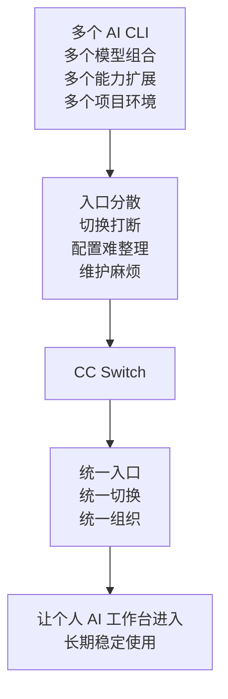
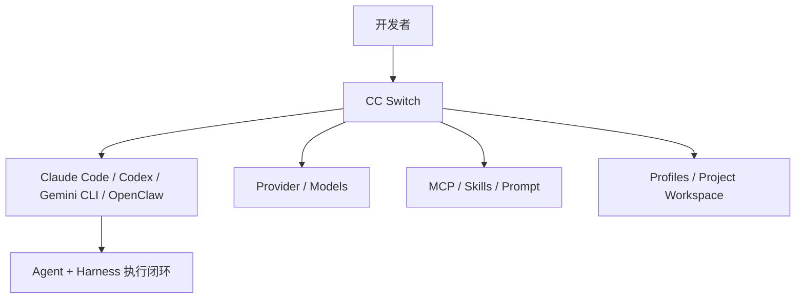
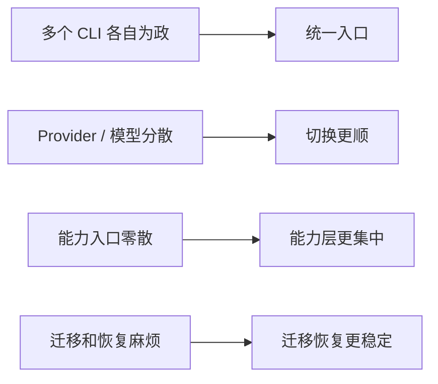

# CC Switch：个人 AI 工作台的统一控制台

前面已经讲清了产品路线和执行链路；这一页往真正的长期使用阶段再走一步，看一个很实用的工作台控制中枢：**CC Switch**。

当你开始同时使用 `Claude Code`、`Codex`、`Gemini CLI`、`OpenClaw`，再叠加不同的 Provider、模型组合、MCP、Skills、Prompt，以及不同项目对应的工作环境之后，你真正要管理的就不再是某一个工具，而是一整套 **个人 AI 工作台**。

它的定位可以概括为：

> CC Switch 不是另一个模型，也不是另一个 Agent；它更像是个人 AI 工作台的统一控制台，把多个 AI CLI、模型与 Provider、能力扩展和常用配置环境收拢到一个入口里。

## 1. 核心问题

很多个人开发者在真正高频使用 AI Coding 工具之后，最先遇到的并不是“模型不够强”，而是自己的工作台越来越难管理：

- 不同任务会切到不同 AI CLI
- 不同项目会依赖不同 Provider 和模型组合
- MCP、Skills、Prompt 预设逐渐变多
- 不同项目对应的工作环境需要来回切换
- 想备份、迁移、恢复工作环境时会发现很麻烦

这类问题，本质上不是单点模型问题，而是 **个人 AI 工作环境的组织与控制问题**。

CC Switch 的价值，就是把这些分散的工具、配置、能力和常用环境收拢成一个统一入口。



## 2. 在整套体系里的位置



- **AI CLI** 是执行任务的入口层，真正负责完成编码、分析、修改和验证。
- **CC Switch** 不是替代这些工具，而是把它们背后的工作环境统一组织起来。
- 它管理的不只是 Provider 和模型，还包括能力扩展层与常用工作环境的组织。
- 这也是它为什么更像“统一控制台”，而不是单点配置面板。

## 3. 它真正管理的是什么

### A. 多个 AI CLI
- 不只是 `Claude Code`，还包括 `Codex`、`Gemini CLI`、`OpenClaw` 这类工具。
- 对个人开发者来说，这意味着你可以按任务选工具，而不是被迫把自己的 AI 工作方式拆成几个孤立入口。

### B. Provider / 模型组合
- 可以统一组织不同的 Provider、模型入口和常用组合。
- 当你已经不是只用一套默认配置时，切换是否顺手，会直接影响你能不能持续高频使用这些工具。

### C. MCP / Skills / Prompt 能力层
- 真正让个人工作台变复杂的，往往不只是账号和 API Key。
- `MCP`、`Skills`、`Prompt` 这些能力入口一旦变多，就需要统一收口，而不是散在各处。

### D. 常用工作环境
- 高强度使用时，个人开发者不只是在切模型，也是在切项目对应的配置组合。
- 比如项目 A 主要用 `Claude Code` + 某套 Provider，项目 B 主要用 `Codex` + 另一套模型入口；当这些组合开始变多，就需要一个统一入口来组织。

### E. 备份 / 恢复 / 迁移
- 当你的 AI 工作台开始长期使用，配置资产本身就值得管理。
- 备份、恢复、迁移不再只是附属功能，而是稳定性的底座。

它解决的不是“某一个模型怎么配”，而是“你整套个人 AI 工作台怎么稳定地组织、切换和延续”。

## 4. 什么时候它会开始变得重要

### 很适合的阶段
- 你已经在多个 AI CLI 之间切换
- 你经常要切 Provider 或模型组合
- 你已经接入一些 `MCP`、`Skills`、`Prompt` 能力
- 你开始在多个项目、多个配置环境之间来回切换
- 你希望把自己的 AI 工作台长期稳定下来

### 还不一定急着上的阶段
- 你只用单一默认配置
- 你几乎不切模型，也不切工具
- 你暂时还没有接入额外能力层
- 你当前的工作状态还没有复杂到需要统一控制台

阶段判断是：

> 当 AI Coding 从“偶尔试试”变成“天天在用”，个人开发者遇到的就不只是模型选择问题，而是整套工作环境的管理问题。

## 5. 安装与接入

安装方式本身不是这一页的重点，它更像是把这套控制台接进你现有工作流的起点。

### macOS
```bash
brew tap farion1231/ccswitch
brew install --cask cc-switch
```

### Windows / Linux
- Windows：安装包或便携版
- Linux：可通过发行版包或通用安装文件接入

如果你已经有现成的 CLI 配置，重点不是“从零重配”，而是把现有工作环境逐步收拢到统一入口里。

## 6. 你会怎么用它

### 方式一：统一管理个人 AI 工作台
- 把多个 AI CLI 放在同一个控制入口里
- 把 Provider、模型组合、MCP、Skills、Prompt 收拢管理
- 把不同项目常用的配置组合整理成更稳定的工作环境

### 方式二：按任务切换不同配置组合
- 写代码时可以偏向某一类 CLI 和模型组合
- 查问题、看仓库、跑流程时可以切到另一套配置组合
- 重点不是“切得快”本身，而是切换之后不用重新手改一堆入口和设置

### 方式三：把长期使用的工作环境稳定下来
- 新机器迁移时更省心
- 配置改乱之后更容易恢复
- 个人工作台不会因为工具越来越多而越来越失控

## 7. 使用边界

### 边界 1：它是控制台，不是执行器
- CC Switch 不会替你完成编码任务。
- 真正执行任务的仍然是 `Claude Code`、`Codex`、`Gemini CLI`、`OpenClaw` 这些工具。

### 边界 2：它管理的是工作环境，不是生成能力
- 它不会让模型本身更聪明。
- 它提升的是你的组织方式、切换效率和长期稳定性。

### 边界 3：切换更容易，不代表可以无成本乱切
- 不同 Provider、模型和工具仍有各自的稳定性、费用和适用范围。
- 控制台让切换更顺，但不替你做技术判断。

### 边界 4：Claude Code 仍然是代表性亮点场景
- 在 Claude Code 场景下，热切换 Provider 数据的体验仍然非常重要。
- 但这一页不该把 CC Switch 缩成 Claude Code 的附属配置器。



## 8. 核心定位

- **它不是某一个 CLI 的附属面板，而是个人 AI 工作台的统一控制台。**
- **它管理的不只是模型和 Provider，还包括多 AI CLI、能力层和常用工作环境。**
- **它的价值不在“更聪明”，而在“让长期使用变得更稳定、更顺手”。**

## 9. 核心结论

- **当工具开始进入长期使用阶段，个人开发者也会遇到工作环境膨胀的问题。**
- **CC Switch 解决的不是生成能力，而是个人 AI 工作台的控制与组织问题。**
- **对高频用户来说，它最实用的价值是：统一入口、切换更顺、常用配置与环境更容易延续。**
