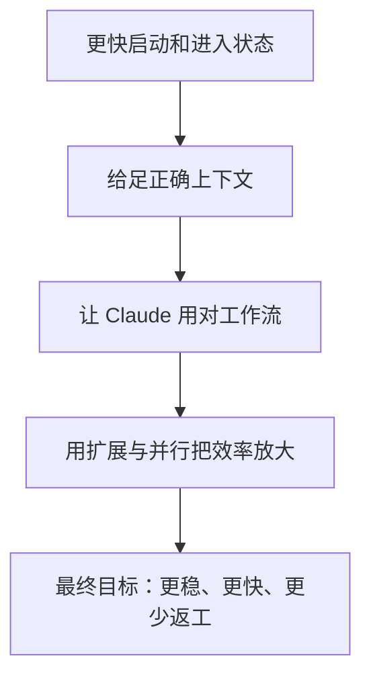
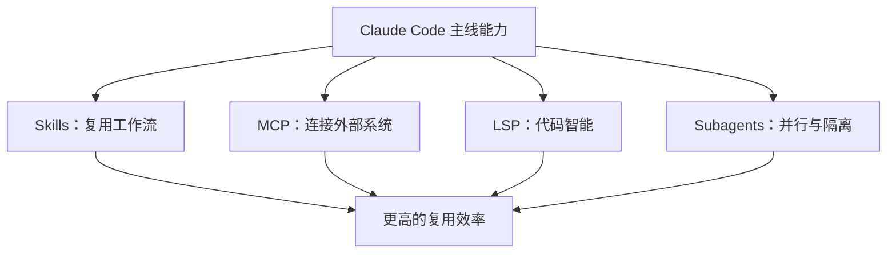
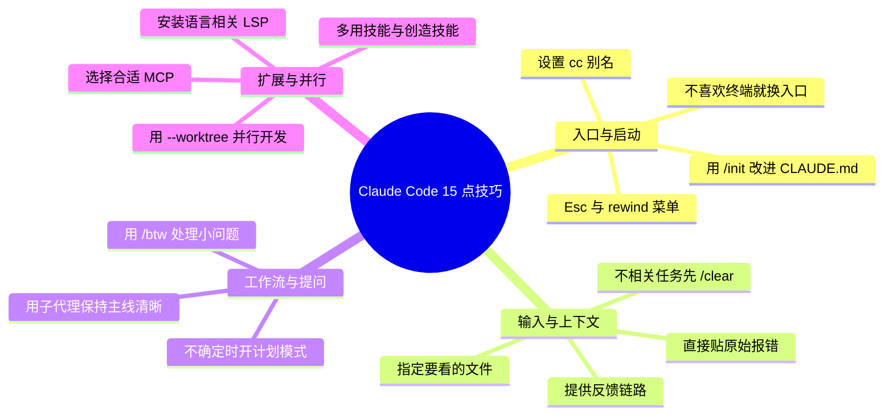

# Claude Code 的 15 点实用技巧：把日常使用效率真正拉起来

前面讲了 Agent、Harness、CLI 和 CC Switch，这一页专门讲 **Claude Code 日常高频、最值得养成的使用习惯**。

如果一句话概括：

> 真正把 Claude Code 用顺手，靠的不只是模型强不强，而是你是否掌握了正确的入口、上下文控制、工作流习惯和扩展能力。

## 1. 先看一张总图：这 15 条技巧在解决什么问题



## 2. 启动与入口：先把最基础的体验调顺

### 1）给 `claude` 设置一个 `cc` 别名
这不是 Claude Code 的核心能力，但它是非常实用的日常习惯。

```bash
alias cc="claude"
```

如果你几乎每天都要进 Claude Code，缩短启动命令会明显减少摩擦。

**适合什么时候用**：
- 你频繁打开 Claude Code
- 你习惯在终端里快速切仓库、快速开工

**注意**：
- 这只是 shell alias，不是 Claude Code 内置功能。
- 更适合个人环境，不一定需要写进团队规范。

### 2）用 `/init` 初始化或改进 `CLAUDE.md`
`/init` 很适合在一个仓库里快速建立 Claude Code 的“项目协作说明”。

它最有价值的地方不是生成一份文档，而是把这些信息收进固定入口：
- 项目结构
- 常用命令
- 开发约定
- 注意事项
- 协作边界

**为什么重要**：
- 这会直接影响 Claude 之后读仓库、改仓库、跑命令时的默认判断。
- 一个好的 `CLAUDE.md`，本质上是在给项目级上下文做持续沉淀。

**注意**：
- 如果仓库里已经有 `CLAUDE.md`，更稳的理解是“改进它”，而不是“把旧文档推翻重写”。

### 3）如果你不喜欢终端，也可以换使用入口
Claude Code 不一定只能在纯终端里用。

如果你不喜欢纯 CLI 交互，也可以考虑：
- Desktop
- Web
- VS Code
- JetBrains

**一句话理解**：
- Claude Code 的核心价值在执行能力，不在“必须盯着黑窗口”。
- 终端只是典型入口，不是唯一入口。

## 3. 交互与上下文：很多效果差，问题出在这里


### 4）按一次 `Esc` 停止当前动作；按两次 `Esc` 打开 rewind / summarize 菜单
这是一个很实用但容易记混的小技巧。

**更准确的理解**：
- 单次 `Esc` 更偏“停一下 / 退出当前状态”
- 连按两次 `Esc` 会打开 rewind / summarize 菜单，可快速进入回看、总结、回滚相关流程

**为什么重要**：
- 当你发现当前方向跑偏时，不需要硬着头皮继续。
- 及时停下、回看和重置，比让错误上下文继续扩散更重要。

**注意**：
- 不要把它过度简化成“Esc+Esc 就等于回滚”。更准确地说，是进入相关菜单和流程。
- 真正需要强中断时，`Ctrl+C` 往往更直接。

### 5）和 Claude 对话时，尽量提供完整的反馈链路
这一条非常重要，而且经常决定结果好坏。

所谓反馈链路，至少包括：
- 你做了什么
- 发生了什么
- 你原本预期什么
- 哪一步开始不对
- 你已经试过什么

**好的说法**：
- “我执行了这个命令，出现这个报错，预期是通过，实际卡在这里。”
- “改完后接口能返回 200，但前端仍然白屏，浏览器控制台报这个错。”

**不要只说**：
- “这里好像不对”
- “有 bug，你看看”

### 6）告诉 Claude 具体要看哪些文件
这条非常实用，而且经常被低估。

比起只说“帮我看看这个问题”，更有效的是直接指明：
- 哪几个文件最相关
- 哪个目录是重点
- 哪个配置文件不能漏看

**为什么重要**：
- 可以减少 Claude 在无关文件上浪费上下文。
- 对大仓库尤其有效。

**更好的表达方式**：
- “优先看 `src/api/user.ts`、`src/hooks/useUser.ts`、`app/routes/profile.tsx`。”
- “这个问题只和 `vite.config.ts`、`package.json`、`tsconfig.json` 有关。”

### 7）别用自己的话转述 bug，直接贴原始报错
这是最值得养成的习惯之一。

**直接贴这些信息，通常比概述更有效**：
- 原始错误栈
- 控制台报错
- 测试失败输出
- 复现命令
- 构建日志中的关键段落

**为什么**：
- 你转述之后，很容易把真正关键的信号丢掉。
- 原始错误往往包含文件、行号、调用栈、错误码和上下文线索。

## 4. 工作流控制：别只会提问，要会用正确模式

### 8）不确定怎么处理时，用计划模式
当事情变复杂时，不要一上来就让 Claude 直接开写。

更适合先开计划模式的场景：
- 需求还不够清楚
- 可能改多个文件
- 有多种实现方案
- 你还想先确认影响范围

**为什么重要**：
- 计划模式本质上是在先把问题结构化。
- 它可以防止 Claude 过早进入实现，最后改了一圈发现方向不对。

### 9）开启不相关的新任务时，先 `/clear`
如果上下文已经很长，或者你准备开始一件完全无关的事，`/clear` 是非常值得用的。

**为什么重要**：
- Claude 的表现非常依赖当前上下文。
- 不相关的旧上下文越多，越容易把新任务带偏。

**一句话理解**：
- `/clear` 不是清空工作成果，而是清空当前会话包袱。

### 10）用 `/btw` 处理顺手的小问题
`/btw` 很适合用来问“当前任务相关，但不想打断主线”的小问题。

比如：
- 这个变量名你更推荐哪个？
- 这个地方更像 bug 还是设计问题？
- 这句注释要不要保留？

**为什么好用**：
- 它不会像主线对话那样持续膨胀上下文。
- 适合快速问一句、拿结论、继续主线。

**注意**：
- 它更像轻量侧问，不适合复杂多轮任务。
- 不要把它当成完整执行流程的替代品。

### 11）用子代理保持主上下文清晰
当你需要：
- 独立调研某个问题
- 搜一堆文件
- 并行看多个方向
- 让别人帮你做一次独立复核

就很适合用子代理。

**它的价值**：
- 主上下文不会被大量搜索结果淹没
- 复杂调查任务可以外包出去
- 很适合“主线推进 + 支线探索”并行进行

## 5. 扩展能力：Claude 越像工程系统，这部分越重要



### 12）尽可能多地用技能，重复流程就把技能做出来
更准确的说法不是“技能越多越好”，而是：

> 只要一个流程会重复出现，就值得考虑把它沉淀成 skill。

典型适合做成 skill 的流程：
- 写计划
- 做代码评审
- 跑某类固定检查
- 做文档生成
- 做某类固定研究动作

**为什么重要**：
- 技能本质上是在做工作流复用。
- 它能把“我知道怎么做”变成“团队下次也能稳定这么做”。

### 13）给你常用语言装好代码智能插件（LSP）
如果你经常写的语言有对应 LSP / code intelligence 能力，尽量配上。

典型收益包括：
- 跳转定义
- 查找引用
- 类型信息
- 符号搜索
- 更准确的代码导航

**特别适合**：
- TypeScript
- Go
- Rust
- Java
- Python
- 其他强类型或大型项目语言

**注意**：
- 不是所有语言都必须装，但只要项目稍微复杂，LSP 往往都值得。

### 14）选对 MCP，比多接 MCP 更重要
MCP 当然能提升效率，但不是接得越多越好。

更合理的原则是：
- 哪个任务真的需要外部系统，就接哪个 MCP
- 尽量避免无关 MCP 干扰上下文和判断
- 围绕真实工作流选，而不是围绕“功能看起来很多”选

**一句话理解**：
- MCP 是效率放大器，但也会引入复杂度。

## 6. 并行与隔离：这是从“好用”到“工程化”的关键一步

### 15）用 `--worktree` 做并行开发
当你同时推进多个方向，或者不想污染当前工作区时，`--worktree` 非常有价值。

特别适合：
- 同时验证两个方案
- 并行处理多个 issue
- 一边主线开发，一边让 Claude 开子线试错
- 需要明显隔离改动范围时

**为什么重要**：
- 并行不是只靠多开几个窗口，更重要的是隔离工作目录和变更范围。
- worktree 让“多个任务同时推进”变得更安全、更清晰。

## 7. 一张图记住这 15 条技巧



## 8. 这一页最想让大家记住什么

- **Claude Code 的使用效果，很大程度上取决于你怎么组织上下文。**
- **很多所谓“模型不行”，其实是输入方式、工作流方式和扩展方式不对。**
- **真正高阶的使用者，不是问得更多，而是更会控制入口、上下文、模式和工具。**
