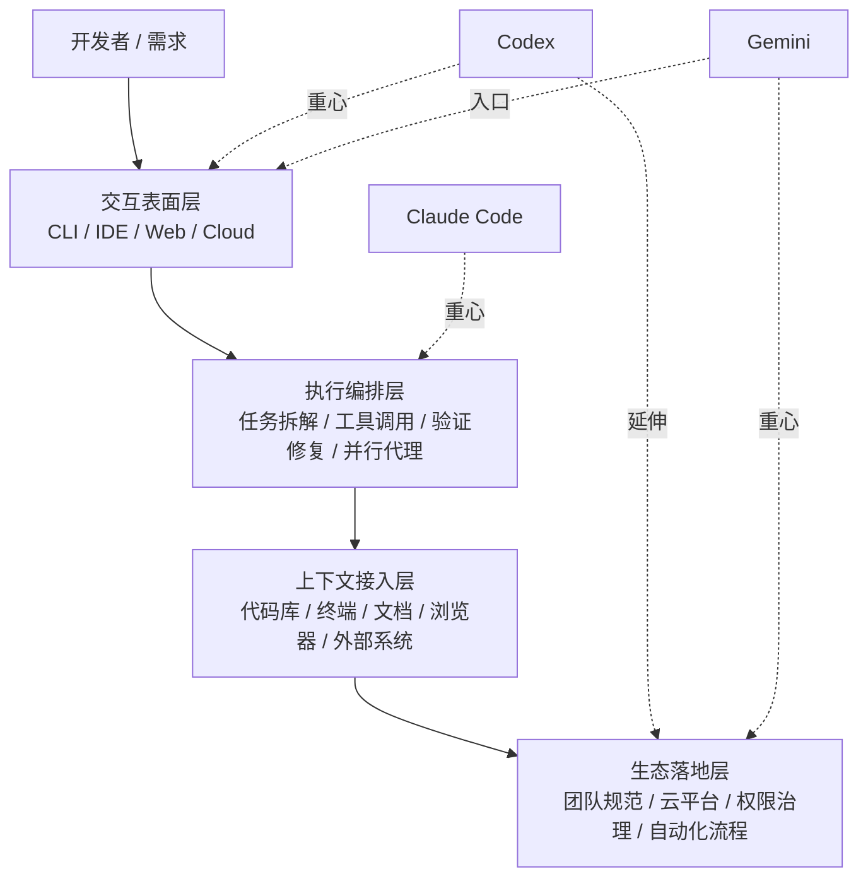

# 为什么是 Agent / Harness / CLI：真正的主战场已经变了

前面已经看过模型层的差异；接下来先不急着拆运行时细节，而是先回答一个更关键的问题：为什么今天 AI Coding 的主战场，会落在 **Agent、Harness 和 CLI** 这一层。

这一章先把产品路线和竞争重心讲清楚，再回头拆开它背后的执行机制。

## 1. 工作方式分层

这里先做一个最小定义：**Copilot 更偏补全，Agent 更偏完整任务执行。**

需求：给网站添加评论功能。

| 模式 | 你在做什么 | AI 在做什么 | 你的角色 |
| :--- | :--- | :--- | :--- |
| **Copilot** | 手动写模型、路由、前端 | 补全当前代码片段 | 执行者 |
| **对话式编辑** | 分步骤说“改哪里、加什么” | 完成局部修改 | 指挥者 |
| **Agent / Claude Code** | 描述目标、约束、技术栈、标准 | 拆解任务、实现、测试、修复 | Reviewer / Owner |

> 差异不只是“谁更聪明”，而是谁能够形成完整执行链路。

## 2. CLI 为什么重要

### IDE 更像局部增强
- 聚焦当前文件、当前编辑动作、当前代码块。
- 很适合补全和局部改写。

### CLI 更像任务执行环境
- 可以把 Git、测试、构建、日志、脚本、网络请求放进同一条链路。
- 很适合承载“实现 -> 验证 -> 修复 -> 交付”的闭环。
- 更接近真实软件工程，也更容易成为 harness 落地执行链路的典型入口。

## 3. 三条产品路线

如果说上一代 AI Coding 的竞争重点是“谁补全得更快、更准”，  
那这一代的竞争重点已经变成：**谁更能把需求变成可执行、可验证、可交付的任务闭环。**

所以今天比较 Claude Code、Codex、Gemini，不能只看模型能力，  
也不能只看 CLI、IDE 或 Web 这些表面入口，而要看它们怎样把 agent 与 harness 组织成完整执行系统。

### 通用 AI Coding Agent / Harness 架构图

无论是哪一家，今天的 AI Coding 本质上都在争四层能力；agent 负责决策与行动，真正把这四层串起来并落到现实系统里的执行底座，就是 harness：

- **交互表面层**：开发者从哪里进入 agent，比如 CLI、IDE、Web、云端任务。
- **执行编排层**：agent 怎样拆任务、调工具、跑验证、继续修复。
- **上下文接入层**：agent 能读到哪些代码、终端、文档、浏览器和外部系统信息。
- **生态落地层**：agent 最终怎样进入团队规范、云平台、权限治理和自动化流程。

三家都在做 agent，但真正拉开体验差异的，往往是它们背后的 harness 设计。  
区别不是“谁会不会写代码”，而是**谁把产品重心压在了哪一层，以及怎样把这些层真正组织成可执行系统**。

## 4. Claude Code / Codex / Gemini：三条不同路线

| 维度 | Claude Code | Codex | Gemini |
| :--- | :--- | :--- | :--- |
| **主战场压在哪** | 执行编排 | 多表面统一入口 | Google 生态联动 |
| **核心产品思路** | 把 agent 做成可编排开发系统 | 把 coding agent 覆盖到 CLI / IDE / Cloud | 把 coding agent 嵌进 IDE + Cloud + Google 工具链 |
| **代表性能力组织方式** | Skills / Hooks / MCP / Subagents | CLI + IDE + cloud tasks + parallel environments | Gemini CLI + Gemini Code Assist + Google Cloud |
| **一个最能说明路线差异的例子** | 子代理做 code review，hooks 拦截关键动作，MCP 拉外部上下文 | 本地提任务，云端独立环境执行，并行环境回收结果 | Cloud Shell 直接运行 CLI，BigQuery Studio / Apigee 直接调用 agent 能力 |
| **更适合解决的问题** | 流程闭环、规范沉淀、团队复用 | 跨环境一致体验、远程执行、任务分发 | 长上下文理解、云上开发、Google 生态协同 |
| **核心定位** | 可编排代理系统 | 统一 coding agent 产品面 | 生态驱动的 coding agent |

- **Claude Code** 更像在做开发代理操作系统：重点不是一个入口，而是如何把能力编排成稳定工作流。
- **Codex** 更像在做统一 coding agent 产品层：重点是同一个 agent 能跨 CLI、IDE、云任务工作。
- **Gemini** 更像在做生态联动型 coding agent：重点是把 CLI、IDE、Google Cloud 串成一条开发链路。

### 这些路线具体是怎么工作的？

- **Claude Code**：你可以把 code review 做成一个专职子代理，写完代码后自动调用 reviewer；再用 hook 拦截危险命令，最后再通过 MCP 去拿 GitHub issue 或内部文档。重点不是“它会不会回答”，而是“它能不能把规则、工具、分工编排成流程”。
- **Codex**：你在本地提一个 bug 修复任务，真正执行发生在云端独立环境里；如果有三个任务，可以扔给三个并行环境同时做，最后你回来统一审结果。重点不是“CLI 本身”，而是“统一入口 + 云端异步执行”。
- **Gemini**：Gemini CLI 可以直接在 Cloud Shell 里跑，这意味着 agent 一开始就站在云端环境里；另一边 Gemini Code Assist 还能直接出现在 BigQuery Studio 或 Apigee 这样的云产品里，直接利用表元数据、API 规范这些云侧上下文。重点不是“单一工具”，而是“把 agent 植入云控制面与产品工作流”。

## 5. 工程师如何选择

- 如果你最看重 **任务闭环、流程编排、团队沉淀**，你会更容易被 Claude Code 打动。
- 如果你最看重 **统一入口、多执行表面、云端任务协同**，Codex 会更顺手。
- 如果你最看重 **IDE + Cloud + Google 生态协同**，Gemini 会更自然。

所以这三者不是简单的高下之分，  
而是分别在回答三个不同问题：

- 怎么把 AI 变成可编排的开发代理系统？
- 怎么把 coding agent 统一铺到所有开发表面？
- 怎么把 coding agent 接进既有 IDE 与云生态？

下一章再往下拆：当这些路线落到真实运行时，一条请求到底怎样经过 Harness、Hooks、MCP、Tools 和 LSP，最终变成可执行闭环。
