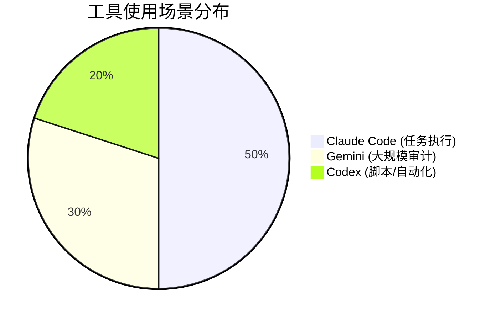

# 硬核三剑客：CLI 时代的生产力

为什么 2026 年的高阶开发者都在回归命令行？

## 1. 工具定位 (Tooling)

### Claude Code: 任务级 Agent
- **特色**: 极强的“自愈”能力。如果命令执行失败，它会自动看 Log 并修复代码。
- **示例**: `claude "重构 user.py，确保所有的输入都有校验"`

### Gemini: 长上下文专家
- **特色**: 百万级 Token。适合扫描整个项目的老旧代码。
- **示例**: `gemini audit . --policy security`

### Codex/OpenAI: 原子化脚本
- **特色**: 灵活，适合作为 Pipeline 的一部分。
