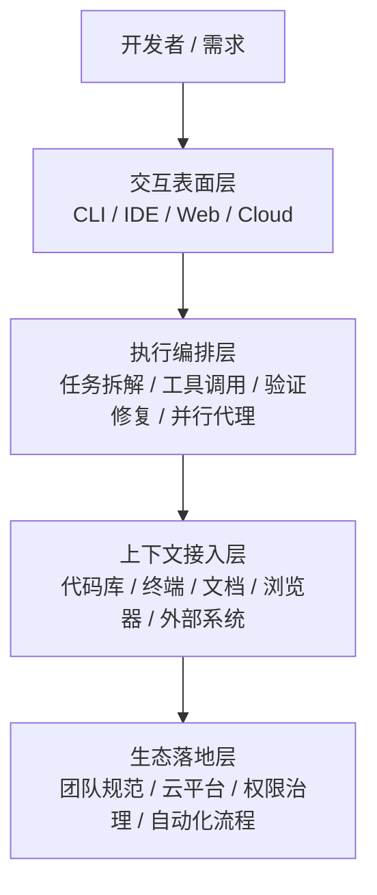

# 为什么是 Agent / Harness / CLI：真正的主战场已经变了

前面已经看过模型层的差异；接下来先不急着拆运行时细节，而是先回答一个更关键的问题：为什么今天 AI Coding 的主战场，会落在 **Agent、Harness 和 CLI** 这一层。

这一章先把产品路线和竞争重心讲清楚，再回头拆开它背后的执行机制。

## 1. 工作方式分层

这里先做一个最小定义：**Copilot 更偏补全，Agent 更偏完整任务执行。**

需求：给网站添加评论功能。

| 模式 | 你在做什么 | AI 在做什么 | 你的角色 |
| :--- | :--- | :--- | :--- |
| **Copilot** | 手动写模型、路由、前端 | 补全当前代码片段 | 执行者 |
| **对话式编辑** | 分步骤说“改哪里、加什么” | 完成局部修改 | 指挥者 |
| **Agent / Claude Code** | 描述目标、约束、技术栈、标准 | 拆解任务、实现、测试、修复 | Reviewer / Owner |

> 差异不只是“谁更聪明”，而是谁能够形成完整执行链路。

## 2. CLI 为什么重要

### IDE 更像局部增强
- 聚焦当前文件、当前编辑动作、当前代码块。
- 很适合补全和局部改写。

### CLI 更像任务执行环境
- 可以把 Git、测试、构建、日志、脚本、网络请求放进同一条链路。
- 很适合承载“实现 -> 验证 -> 修复 -> 交付”的闭环。
- 更接近真实软件工程，也更容易成为 harness 落地执行链路的典型入口。

## 3. 产品竞争为什么会转到执行体系

如果说上一代 AI Coding 的竞争重点是“谁补全得更快、更准”，  
那这一代的竞争重点已经变成：**谁更能把需求变成可执行、可验证、可交付的任务闭环。**

所以今天比较 Claude Code、Codex、Gemini，不能只看模型能力，  
也不能只看 CLI、IDE 或 Web 这些表面入口，而要看它们怎样把 agent 与 harness 组织成完整执行体系。

### 通用 AI Coding Agent / Harness 架构图

无论是哪一家，今天的 AI Coding 都可以先拆成四层：agent 负责决策与行动，真正把这四层串起来并落到现实系统里的执行底座，就是 harness。

- **交互表面层**：开发者从哪里进入 agent，比如 CLI、IDE、Web、云端任务。
- **执行编排层**：agent 怎样拆任务、调工具、跑验证、继续修复。
- **上下文接入层**：agent 能读到哪些代码、终端、文档、浏览器和外部系统信息。
- **生态落地层**：agent 最终怎样进入团队规范、云平台、权限治理和自动化流程。

真正拉开体验差异的，往往不是单一入口，而是背后的 harness 设计。  
区别不是“谁会不会写代码”，而是**谁更能把这四层稳定地组织成执行体系**。

下一节再具体看 Claude Code、Codex、Gemini 各自把重心放在哪里。

## 4. Claude Code / Codex / Gemini：三种执行体系的不同组织方式

这三者都在做 coding agent，但它们组织执行体系的方式并不一样。  
所以这里不是比“有没有同一个功能”，而是比：**各自如何把流程复用、外部能力、执行链路、并行与隔离组织起来。**

| 职责层 | Claude Code | Codex | Gemini |
| :--- | :--- | :--- | :--- |
| **流程复用 / 项目规则** | 官方明确有 `Skills`；也有 `Hooks` 在生命周期事件自动触发规则 | 官方明确有 `AGENTS.md` 作为 repo-specific instructions | 官方资料目前更强调 `agent mode` 与工具调用，本页不把它写成和 `Skills` / `AGENTS.md` 对等的项目规则机制 |
| **外部能力接入** | 官方明确有 `MCP servers` | 这页不把 Codex 写成 `MCP` 架构 | 官方明确有 `built-in tools` 和 `MCP servers` |
| **工具 / 执行链路** | 官方明确有 `agentic loop` 和 `agentic harness`；执行链路由 harness 组织，能力入口包括 `Skills`、`LSP`、`Subagents`、`MCP` 等 | 官方明确有 cloud env 执行链：`container → setup script → agent phase → validation` | 官方明确有 `Gemini CLI`、`Gemini Code Assist`、`agent mode`、`built-in tools`、`MCP servers` |
| **并行 / 隔离** | 官方明确有 `Subagents`；也有 `isolation: worktree` | 官方明确有 `subagents`；cloud tasks 运行在 `container` 中；本地有 `sandboxing` 模式 | 官方最稳的是 `Cloud Shell`：`temporary VM`，也支持 `ephemeral mode` |
| **官方产品表面** | 官方资料更强调 `Claude Code` 作为 CLI 型 `agentic harness` 与可编排能力组织 | 官方明确有 `App / IDE Extension / CLI / Web` | 官方明确有 `Gemini CLI`、`Gemini Code Assist` 等产品表面 |

> 这不是同名功能对比，而是三套执行体系在相近职责层上的对照。

- **Claude Code** 的官方资料最清楚地呈现出一套由 `Skills / Hooks / MCP / Subagents / Worktree / LSP / harness` 组成的执行体系。
- **Codex** 的官方资料更清楚地强调 `cloud environments`、`subagents`、`sandboxing` 和多表面产品形态。
- **Gemini** 的官方资料更清楚地强调 `Gemini CLI`、`Gemini Code Assist agent mode`、`built-in tools / MCP servers` 和 Google Cloud / 产品集成表面。

所以它们真正的差异，不在“会不会写代码”，而在**怎样把复用、连接、执行、并行、隔离组织成系统**。

## 5. 工程师如何选择

- 如果你最看重 **任务闭环、流程编排、团队沉淀**，你会更容易被 Claude Code 打动。
- 如果你最看重 **统一入口、多执行表面、云端任务协同**，Codex 会更顺手。
- 如果你最看重 **IDE + Cloud + Google 生态协同**，Gemini 会更自然。

所以这三者不是简单的高下之分，  
而是分别在回答三个不同问题：

- 怎么把 AI 变成可编排的开发代理系统？
- 怎么把 coding agent 统一铺到所有开发表面？
- 怎么把 coding agent 接进既有 IDE 与云生态？

下一章再往下拆：当这些路线落到真实运行时，一条请求到底怎样经过 Harness、Hooks、MCP、Tools 和 LSP，最终变成可执行闭环。
