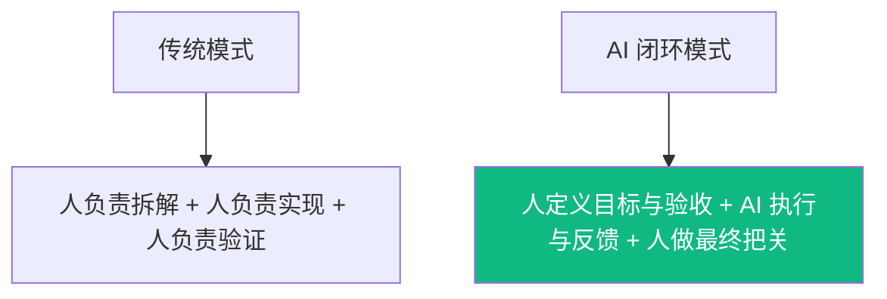

# 核心章节：AI 如何真正进入研发闭环

前面讲的是工具和术语，这一章讲真正最重要的部分：一个需求，怎样在 Agent 决策、Harness 执行的配合下走完完整研发链路。

## 1. 先看最关键的变化

### 重点不是“AI 写代码更快”
而是：
- 它能不能理解目标
- 它能不能根据反馈继续修正
- 它能不能把实现、测试、修复串成一个闭环

## 2. 一个完整的 Agent / Harness 工作流

### 第一步：输入目标
开发者要给的不只是需求，还有约束。
- 要做什么功能
- 用什么技术栈
- 哪些边界必须满足
- 什么叫“完成”

### 第二步：生成计划
AI 先拆任务，而不是直接开写。
- 会改哪些文件
- 先做数据结构还是先做接口
- 测试怎么补
- 哪些步骤有风险

### 第三步：执行实现
AI 开始真正干活。
- 读现有代码
- 编写或修改实现
- 补充测试、脚本、文档

### 第四步：运行验证
这里决定它是“生成器”还是“执行系统”。
- Agent 判断下一步该验证什么
- Harness 调用测试、lint、build 等能力真正执行验证
- 读取日志和错误输出
- 判断结果是否符合预期

### 第五步：自愈修复
如果失败，不是停下来，而是继续修。
- 读取错误信息
- 调整实现策略
- 修复边界 bug
- 再通过 harness 跑一轮验证

### 第六步：交付结果
最后不是只给一段代码，而是给一份可交付结果。
- 改了什么
- 为什么这么改
- 哪些风险还在
- 下一步建议是什么

## 3. 用一个例子串起这六步

### 场景：给网站增加评论功能
需求：支持发表评论、查看评论、删除评论；评论关联文章；前端 React，后端 Express。

#### 目标输入
- 功能范围：评论 CRUD
- 技术约束：React + Express
- 验收标准：接口可用、前端可交互、测试通过

#### AI 拆解计划
- 分析现有目录与依赖
- 设计评论 schema
- 增加后端接口
- 增加前端列表与表单
- 补测试与边界校验

#### AI 执行闭环
- 写实现
- 跑测试
- 发现边界 bug
- 修复后再次验证
- 输出结果摘要

## 4. 人和 AI 分别负责什么

### AI 更适合负责
- 机械实现
- 样板代码
- 重复性修改
- 根据反馈快速迭代

### 人必须负责
- 目标是否定义正确
- 业务规则是否遗漏
- 风险是否可接受
- 是否真的可以上线

## 5. 这一章真正想让大家记住什么
- **Agent 的价值不在生成，而在闭环。**
- **验证能力决定了 AI 是否能进入真实研发流程。**
- **人的价值没有消失，而是前移到目标定义、边界约束和最终验收。**