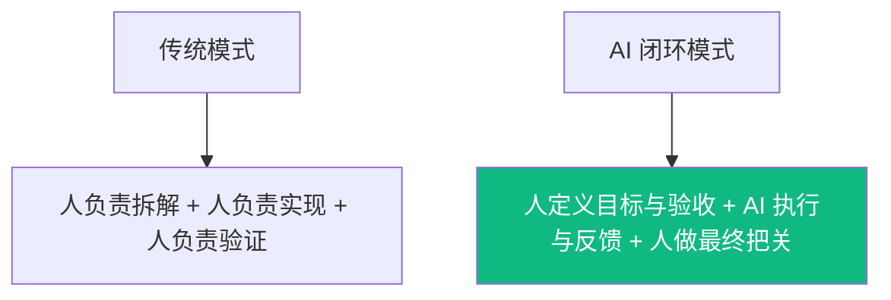

# 核心章节：AI 如何真正进入研发闭环

前面已经讲了模型层、产品路线、运行机制、配置中枢和日常使用习惯；这一章开始进入真正最重要的部分：一个需求，怎样在 Agent 决策、Harness 执行的配合下走完完整研发链路。

## 1. 关键变化

### 重点不是“AI 写代码更快”
而是：
- 它能不能理解目标
- 它能不能根据反馈继续修正
- 它能不能把实现、测试、修复串成一个闭环

## 2. 完整工作流

### 第一步：输入目标
开发者要给的不只是需求，还有约束。
- 要做什么功能
- 用什么技术栈
- 哪些边界必须满足
- 什么叫“完成”

### 第二步：生成计划
AI 先拆任务，而不是直接开写。
- 会改哪些文件
- 先做数据结构还是先做接口
- 测试怎么补
- 哪些步骤有风险

### 第三步：执行实现
AI 开始真正干活。
- 读现有代码
- 编写或修改实现
- 补充测试、脚本、文档

### 第四步：运行验证
这里决定它是“生成器”还是“执行系统”。
- Agent 判断下一步该验证什么
- Harness 调用测试、lint、build 等能力真正执行验证
- 读取日志和错误输出
- 判断结果是否符合预期

### 第五步：自愈修复
如果失败，不是停下来，而是继续修。
- 读取错误信息
- 调整实现策略
- 修复边界 bug
- 再通过 harness 跑一轮验证

### 第六步：交付结果
最后不是只给一段代码，而是给一份可交付结果。
- 改了什么
- 为什么这么改
- 哪些风险还在
- 下一步建议是什么

## 3. 具体场景

### 场景：给内部后台补一个审批流节点
需求：在现有审批系统里增加一个“AI 生成初稿后需人工确认”的节点；前端需要展示状态，后端需要记录审批人与操作时间。

#### 目标输入
- 功能范围：新增审批节点、状态展示、操作记录
- 技术约束：沿用现有前后端栈，不新引入工作流引擎
- 验收标准：流程可流转、状态可见、审计字段完整、测试通过

#### AI 拆解计划
- 分析现有审批流与状态机
- 设计新增节点与状态字段
- 增加后端流转接口与记录逻辑
- 增加前端状态展示与确认入口
- 补测试与边界校验

#### AI 执行闭环
- 写实现
- 跑测试
- 发现边界 bug
- 修复后再次验证
- 输出结果摘要

## 4. 人与 AI 的分工

### AI 更适合负责
- 机械实现
- 样板代码
- 重复性修改
- 根据反馈快速迭代

### 人必须负责
- 目标是否定义正确
- 业务规则是否遗漏
- 风险是否可接受
- 是否真的可以上线

## 5. 这一章的核心结论
- **Agent 的价值不在生成，而在闭环。**
- **验证能力决定了 AI 是否能进入真实研发流程。**
- **人的价值没有消失，而是前移到目标定义、边界约束和最终验收。**

---

接下来回到人的位置：当 AI 已经能参与交付时，开发者最核心的职责会往哪里迁移。