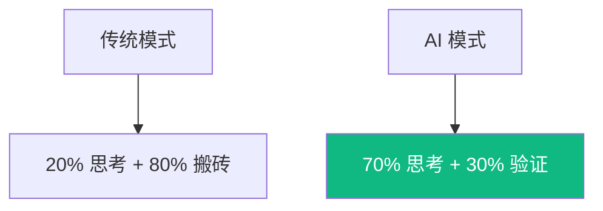

# 闭环：全链路实战演示

演示一个功能从“需求”到“上线”的 AI 协同路径。

## 1. 提效公式 (The Formula)

### 实战步骤：
1. **初始化 (`gemini init`)**: 生成符合团队架构的项目骨架。
2. **TDD 开发 (`claude test-driven`)**: 定义测试用例 -> AI 自动写代码实现。
3. **自愈修复**: 如果 Lint 或测试挂了，AI 会自动读取 Error 信息并自我纠错。
4. **交付文档 (`gemini doc`)**: 对比 Git Diff 自动生成 Changelog。
