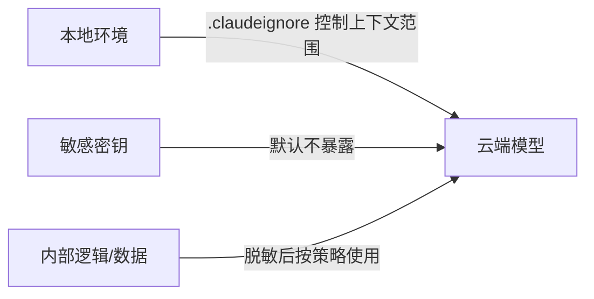
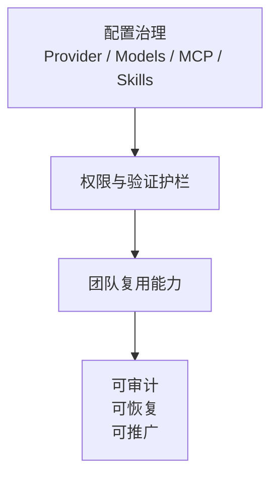

# 企业治理与边界：从能用到可控

当 AI 真的进入研发闭环，问题就不再只是“会不会用”，而是“怎么把 Agent 和 Harness 放进团队流程里，并且放心地一起用”。

## 1. 先划清边界

### 第一原则
- 不是所有上下文都应该发给模型。
- 企业真正要治理的，不只是模型本身，而是整套 harness 的上下文暴露、权限边界与执行能力。
- 企业真正要做的是**最小暴露、分级治理、可审计使用**。

## 2. 企业真正关心的四类问题

### A. 安装与接入门槛
- 团队成员是否都能稳定安装和启动 CLI
- Windows、代理、网络出口等基础问题如何统一处理
- 是否有统一 onboarding 文档和常见问题指引

### B. 数据与隐私边界
- 哪些文件可以进入模型上下文
- 哪些密钥、配置、内部数据必须严格排除
- 是否有脱敏和审计要求

### C. 权限与执行边界
- AI 能不能直接执行命令
- 能不能访问网络
- 能不能改哪些目录
- 哪些动作必须人工确认

### D. 质量、成本与稳定性边界
- 是否必须经过 lint / test / build
- 是否要有代码评审和安全审查
- 如何限制无意义重试与 Token 消耗
- 如何防止 Agent 在错误路径上越跑越贵

## 3. 可以沉淀成团队能力的东西

- **.claudeignore**：统一上下文暴露策略
- **通用别名 / Skill / Prompt 模板**：沉淀团队最佳实践
- **验证护栏**：把测试、构建、review 前置成固定动作
- **模型使用策略**：不同任务对应不同模型和成本级别

## 4. 这一章的结论
- **个人能用，不等于团队能落地。**
- **企业治理的核心不是禁止，而是给 harness 设边界。**
- **真正可复制的 AI 研发方式，一定包含权限、验证、成本和审计。**