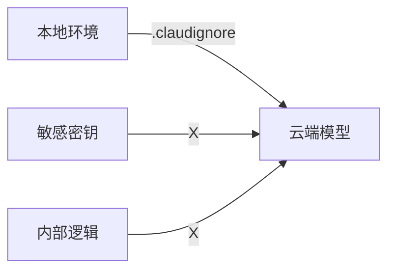

# 治理：企业级落地深度思考

安全、隐私与效能的平衡。

## 1. 隐私边界图 (Security)

```mermaid
graph LR
    Local[本地环境] -- ".claudignore" --> Cloud[云端模型]
    Secret[敏感密钥] -- "X" --> Cloud
    Private[内部逻辑] -- "X" --> Cloud
```

### 核心策略：
- **.claudignore**: 强制配置，防止关键密钥及隐私数据上传。
- **Alias (别名)**: 建立团队公用的提效指令库。
- **Cost 控制**: 避免 AI 进入重试死循环导致 Token 爆炸。
