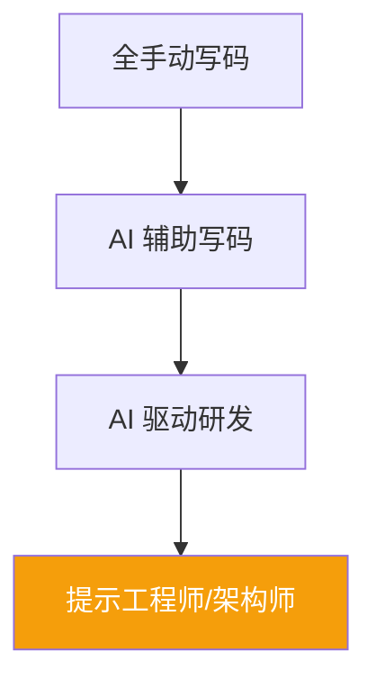

# 未来：开发者角色的演进

从“搬砖工”进化为“架构评审员”。

## 1. 角色变迁 (Roles)

```mermaid
graph TD
    A[全手动写码] --> B[AI 辅助写码]
    B --> C[AI 驱动研发]
    C --> D[提示工程师/架构师]
    style D fill:#f59e0b,color:#fff
```

### 核心建议：
- **深耕系统架构**: AI 擅长代码，人类擅长架构设计。
- **掌握“指令编程”**: 精确、有约束的 Prompt 是 2026 年的基本功。
- **保持好奇**: AI Coding 的工具链每周都在变。
