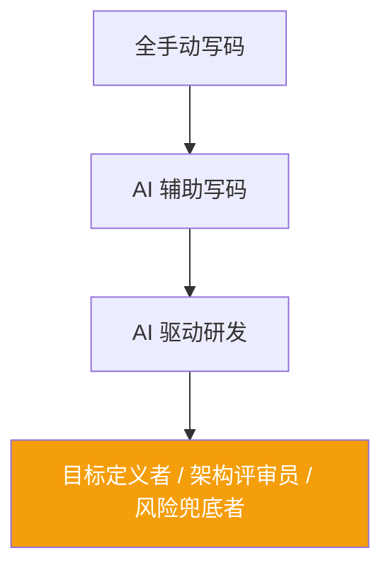

# 角色演进与结尾：开发者不会消失，但会重新分工

当 AI 开始承担越来越多的实现工作，开发者最值钱的能力并没有消失，只是发生了迁移。

## 1. 角色正在变化

## 2. 更值钱的能力在往哪里迁移

### 以前更稀缺的能力
- 熟记语法
- 手写实现速度
- 熟悉框架 API 细节

### 现在更稀缺的能力
- **系统设计**：知道该怎么拆、怎么连、哪里是边界
- **需求表达**：把模糊诉求变成可执行目标与验收标准
- **代码审查**：快速看出逻辑漏洞、边界遗漏和安全问题
- **AI 协作**：知道什么时候放手给 AI，什么时候必须拉回人工判断

## 3. 工作方式会怎么变

下面是一种典型但非绝对的变化示意。

### 以前的一天
- 更多时间花在手工实现和重复性修改
- 调试和验证高度依赖人工逐步推进

### 现在的一天
- 更多时间花在定义目标、审查结果、处理复杂边界
- 让 AI 吞掉机械工作，把精力留给真正需要判断力的地方

## 4. 最后想留下的三个判断
- **第一**：AI Coding 的重点不是“会不会生成代码”，而是“能不能进入真实交付”。
- **第二**：未来开发者最重要的能力，不是写得更快，而是判断得更准。
- **第三**：真正强的团队，不是单点高手多，而是能把 AI 能力沉淀成流程与规范。

---

> 我们不是把开发工作交给 AI，而是在重新定义：哪些事情应该让 AI 去做，哪些判断必须由人来负责。